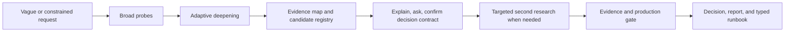

<h1 align="center">research-anything</h1>

<p align="center"><b>Evidence-gated research for decisions that may reach production.</b></p>

<p align="center">A Claude Code skill that can start from a vague question, discover the real decision space, ask for the constraints you could not know in advance, and stop weak evidence from becoming a confident recommendation.</p>

<p align="center">
  <a href="README.md">English</a> ·
  <a href="README_CN.md">简体中文</a> ·
  <a href="README_JA.md">日本語</a> ·
  <a href="README_KO.md">한국어</a> ·
  <a href="README_ES.md">Español</a> ·
  <a href="README_FR.md">Français</a> ·
  <a href="README_DE.md">Deutsch</a> ·
  <a href="README_PT.md">Português</a> ·
  <a href="README_RU.md">Русский</a>
</p>

> research-anything is built for questions such as "How should we produce an AI comic drama?" where the requester does not yet know which constraints matter. It researches before forcing premature choices, preserves the evidence behind every conclusion, and is allowed to say that a production decision is not ready.

## What v3 changes

Ordinary research agents tend to collect many links and then compress them into a plausible answer. v3 treats research as an auditable decision process:

1. **Start from the user's actual request.** The original wording is stored verbatim, without an agent rewriting it into a more convenient requirement.
2. **Probe broadly.** Douyin, Xiaohongshu, Zhihu, Bilibili, YouTube, GitHub, X/Twitter, and the general web form the current discovery layer. They are probes, not a claim that eight platforms equal complete coverage.
3. **Deepen adaptively.** Research effort follows new candidates, contradictions, independent evidence, freshness, and decision-critical gaps instead of giving every channel the same fixed quota.
4. **Explain, then ask.** Claude explains unfamiliar terms, the candidate landscape, corroborated findings, disputes, and unknowns before asking the few questions that would materially change the choice.
5. **Research again when constraints change the answer.** A newly discovered budget, latency, licensing, accessibility, safety, or operating constraint triggers targeted second-pass research. The first search is not treated as final evidence for a newly narrowed problem.
6. **Apply a production gate.** A recommendation is released as `production-ready`, `pilot-only`, or `blocked`. Missing critical evidence cannot be hidden behind a polished report.

The eight channels are only the broad discovery layer. Each domain profile also requires the appropriate primary sources. Technical selection, for example, must check official documentation, papers or model cards, repositories and issues, independent benchmarks, current pricing, security, and licensing. Travel research must check current operator, booking, transport, weather, and official destination information. High-risk domains have stricter boundaries.

## Workflow



Research time is intentionally not promised as "30–60 minutes." A run may be short when the evidence is simple and accessible, or take hours when video transcription, access failures, conflicting sources, user clarification, or a representative proof of concept is required. The exported manifest records actual state and costs rather than a marketing estimate.

## Readiness states

| State | Meaning |
|---|---|
| `production-ready` | The decision contract is explicitly confirmed, every critical claim has sufficient traceable evidence, all findings are consumed or excluded, budgets are settled, and the production-relevant validation is complete. |
| `pilot-only` | There is a credible candidate, but quality, integration, performance, operations, or another material condition still needs a bounded proof of concept. It is not a production recommendation. |
| `blocked` | A critical requirement, permission, source, license, safety fact, budget, or piece of evidence is missing or contradictory. The output contains the smallest actions needed to unblock the decision, not a fabricated default. |

The gate can downgrade a requested status. The report renderer cannot upgrade it.

## Durable, auditable state

Each v3 run uses `research.db` as its canonical SQLite/WAL state store. JSON and JSONL files are immutable-style exports for inspection and delivery; they are not edited as workflow state.

Typical output under `docs/research/<topic>/`:

| File | Purpose |
|---|---|
| `research.db` | Resumable source of truth for events, approved plan revisions, findings, candidates, claims, evidence clusters, attempts, budgets, decisions, and deliveries. |
| `manifest.v3.json` | Run identity, profile, gate result, counts, budget totals, and generation time. |
| `events.jsonl` | Append-only conversation and system events. User utterances are preserved exactly in `verbatim`, separately from agent interpretation. |
| `plan.json` / `plan-revisions.jsonl` | Validated eight-entry search scope, estimates, hard budgets, approval-event binding, and append-only plan history. |
| `findings.jsonl` | Stable-fingerprint per-item notes and their consumed/excluded disposition. |
| `finding-revisions.jsonl` | Append-only history of note/content revisions; a changed finding returns to pending review. |
| `candidates.jsonl` / `artifacts.jsonl` | Canonical selectable candidates and content-addressed evidence artifacts. A production POC must reference a real hashed `poc-result` file. |
| `claims.jsonl` | Atomic decision claims and their evidence sufficiency. |
| `evidence-clusters.jsonl` | Independent-source groupings so reposts and common upstream sources are not counted as separate corroboration. |
| `attempts.jsonl` | ASR and other metered attempts, including reservations, provider task IDs, final charges, and unknown outcomes. |
| `decision.json` | The single machine-readable source for constraints, readiness, recommendation, alternatives, gaps, and proof-of-concept requirements. |
| `decision-revisions.jsonl` | Append-only decision history tied to the plan revision used for each decision. |
| `report.html` | Escaped, human-readable report rendered from the current decision. |
| `runbook.json` | Typed `implementation`, `itinerary`, `forecast`, or `research-only` runbook rendered from the same decision. |
| `delivery-manifest.json` | File hashes and delivery revision used to detect stale or inconsistent output. |

Interrupted runs resume from the database, note cursor, and attempt journal. Retries create new attempts and preserve history; they do not delete an entire channel's evidence.

The structured decision contract is also integrity-bound: the exact JSON shown by the main agent is recorded before the user's separate confirmation, and both event IDs are part of the immutable decision revision.

## Hard ASR budgets and idempotency

Paid speech-to-text is disabled by default because a new run starts with a zero ASR duration and cost limit unless an explicit numeric budget is recorded.

Before any metered request, v3 atomically reserves both duration and money. The provider result then settles, releases, or marks that reservation `unknown`. Concurrent calls cannot reserve beyond the configured limits, and an unresolved charge continues to hold budget. A media fingerprint plus model/options request fingerprint makes retries idempotent even when a platform changes its signed CDN URL.

This is a hard accounting boundary, not a prompt asking the agent to remember a budget.

## Quick start

### Requirements

- [Claude Code](https://claude.com/claude-code). v3 currently targets Claude Code only.
- Python 3.11 or newer.
- Git.
- Optional channel tools and accounts only for the capabilities you choose to enable.

### Install

```bash
git clone https://github.com/Somezak1/research-anything.git ~/research-anything
cd ~/research-anything

# Inspect Claude Code, Python, installation sync, and optional connectors.
python3 scripts/install_skill.py doctor

# Install the canonical runtime bundle into ~/.claude/skills/research-anything.
python3 scripts/install_skill.py install

# Verify that the installed bundle matches this checkout.
python3 scripts/install_skill.py check
```

`install` refuses to overwrite a different existing copy. After inspecting the difference, update with a timestamped backup:

```bash
cd ~/research-anything
git pull
python3 scripts/install_skill.py check
python3 scripts/install_skill.py install --force
python3 scripts/install_skill.py check
```

Set `CLAUDE_SKILLS_DIR` to change the skills parent directory, or pass `--target`. Set `RESEARCH_TOOLS_DIR` if optional connectors live somewhere other than `~/tools`:

```bash
export RESEARCH_TOOLS_DIR="$HOME/my-research-tools"
python3 scripts/install_skill.py doctor
```

The doctor reports capability gaps; it does not silently install, log in to, or authorize third-party collectors.

## Use

Open a fresh Claude Code session in the project that should receive the research output and state the real question. Explicitly naming the skill is useful when the request could be interpreted as ordinary web search:

```text
Use research-anything to investigate how to produce an AI comic drama for a real
product. I do not yet know which workflow or constraints matter. Research the
landscape first, explain the trade-offs, and help me choose.
```

A constrained request works too:

```text
Use research-anything to plan a three-day family road trip. We have two adults,
one toddler, and one older adult with limited walking; confirm current transport,
booking, weather, and accessibility information before producing the itinerary.
```

Expect Claude to pause at meaningful authorization and decision points. In particular, it must preserve your answers verbatim, show its structured decision contract, and ask you to confirm that contract before a `production-ready` result is possible.

For an active v3 run, the state CLI can inspect health and progress without editing exports:

```bash
python3 ~/.claude/skills/research-anything/scripts/researchctl.py doctor \
  --db docs/research/<topic>/research.db
python3 ~/.claude/skills/research-anything/scripts/researchctl.py status \
  --db docs/research/<topic>/research.db
```

## Connector capabilities and limitations

Channel availability depends on tools, region, authentication, platform behavior, and the permissions you grant. A missing connector is recorded as a capability gap. It is not converted into a successful empty search.

| Discovery source | Typical capability | Important limitations |
|---|---|---|
| General web and official sites | Current primary documents, pricing, policies, schedules, and verification | Access and rendering depend on the Claude Code web/browser tooling available in the environment. |
| GitHub | Repositories, releases, code, licenses, and issue evidence | Requires available GitHub access; popularity is not evidence of production fit. |
| YouTube and Bilibili | Metadata and subtitles; authorized ASR when needed | `yt-dlp`, cookies, region, subtitles, and media access may be unavailable. |
| Douyin, Xiaohongshu, Zhihu, and Bilibili community data | Posts, comments, images, and video references | Platform login and anti-automation controls can block collection; account actions are never assumed. |
| X/Twitter | Posts, threads, and replies | Authentication and platform controls change frequently; failure must be disclosed. |

`MediaCrawler` is an optional connector for personal, non-commercial learning/research only under its upstream [NON-COMMERCIAL LEARNING LICENSE](https://github.com/NanmiCoder/MediaCrawler/blob/main/LICENSE). It is not enabled as the default for commercial research. Commercial or organizational use requires a separately authorized collection path, such as official APIs, permitted browser-assisted collection, or user-supplied exports.

This repository does not bundle accounts, cookies, API keys, or permission to collect from any platform. Review each provider's terms, content rights, privacy requirements, account risk, API fees, and geographic rules. Claude usage, APIs, ASR, proxies, commercial data access, and other connectors may all incur cost; this project does not claim that everything except ASR is free.

## Validate a delivery

The skill runs these controls as part of the workflow. They are also available for audit and CI:

```bash
python3 ~/.claude/skills/research-anything/scripts/researchctl.py gate \
  --db docs/research/<topic>/research.db
python3 ~/.claude/skills/research-anything/scripts/researchctl.py export \
  --db docs/research/<topic>/research.db \
  --out-dir docs/research/<topic>
python3 ~/.claude/skills/research-anything/scripts/render_delivery.py \
  --decision docs/research/<topic>/decision.json \
  --findings docs/research/<topic>/findings.jsonl \
  --events docs/research/<topic>/events.jsonl \
  --report docs/research/<topic>/report.html \
  --runbook docs/research/<topic>/runbook.json \
  --delivery-manifest docs/research/<topic>/delivery-manifest.json
python3 ~/.claude/skills/research-anything/scripts/validate_delivery.py \
  --out-dir docs/research/<topic>
```

HTML and runbook output are rendered from `decision.json`; they should not be hand-edited into agreement after a retry.

## Audit a legacy v2 run

v2 output remains readable but is not treated as v3 evidence. The read-only auditor identifies problems such as stale reports, conflicting totals, unresolved ASR attempts, weak verbatim records, or unconsumed artifacts without rewriting the old run:

```bash
python3 scripts/audit_v2.py \
  --out-dir /path/to/legacy/docs/research/<topic> \
  --out /tmp/v2-audit.json
```

Use `--strict` in CI or review workflows to return a non-zero exit status when blocker or high-severity findings exist.

## Repository layout

```text
research-anything/
├── SKILL.md                  # Concise Claude Code orchestration contract
├── references/               # Domain, channel, evidence, summarization, and delivery protocols
├── scripts/
│   ├── install_skill.py      # Install/check/doctor for the public skill bundle
│   ├── researchctl.py        # Canonical v3 SQLite state and production gates
│   ├── render_delivery.py    # Deterministic escaped report/runbook renderer
│   ├── validate_delivery.py  # Cross-artifact delivery validator
│   └── audit_v2.py           # Read-only legacy auditor
└── pyproject.toml            # Python 3.11+ and test configuration
```

## Development

The runtime uses the Python standard library. Tests use `pytest`:

```bash
python3 -m pytest
python3 -m py_compile scripts/*.py
```

## Scope

research-anything improves the traceability and decision discipline of research; it cannot make inaccessible evidence available, turn correlated reposts into independent confirmation, or replace a representative production test. `blocked` is a valid and often valuable result.
