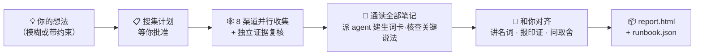

<h1 align="center">🔍 research-anything</h1>

<p align="center"><b>给它一个想法，还你一个方案。</b></p>

<p align="center">Claude Code 的全渠道调研 skill —— 跨 8 个渠道收集一手做法，自主派 agent 查证补课，<br/>把海量信息收束成<b>一个切实可行、符合你自身情况的方案</b>，而不是海量方案的罗列。</p>

<p align="center">
  
  
  
  
  
</p>

<p align="center">
  <a href="#-为什么和ai-搜一圈不一样">为什么不一样</a> •
  <a href="#-一次调研是怎么跑完的">它怎么跑</a> •
  <a href="#-快速开始">快速开始</a> •
  <a href="#-首次配置一次性">首次配置</a> •
  <a href="#-使用">使用</a> •
  <a href="#-各渠道能拿到什么">渠道能力</a> •
  <a href="#-faq">FAQ</a>
</p>

---

> **市面上的先进做法，不该锁在你刷不到的信息流里。**
> 真正有用的实操经验，散落在抖音和小红书的视频里、B站的长测评里、知乎的从业者长答里、GitHub 的 issue 里、Twitter 的 thread 里——普通网页搜索够不到，AI 的训练数据又停在过去。闭门造车的结果往往是：做出来才发现方案已经落后好几代。
>
> research-anything 把 **「全渠道搜集 → 证据核实 → 收束成方案」** 整个流程固化成一个 Claude Code skill，一句话触发，30–60 分钟跑完。

📱 抖音 · 📕 小红书 · 💬 知乎 · 📺 B站 · ▶️ YouTube · 🐙 GitHub · 🐦 Twitter(X) · 🌐 通用网页

## ✨ 为什么和"AI 搜一圈"不一样

| | 常规的"AI 帮我调研一下" | research-anything |
|---|---|---|
| **信息来源** | 训练数据里的旧知识 + 几次浅层网页搜索 | 8 个渠道的一手内容，含网页搜不到的短视频/社区实操 |
| **视频和配图** | 看不了，只能读标题和简介 | 取字幕 / 转写口播全文、识别配图文字、抓高赞评论，全部进证据 |
| **遇到不认识的新名词** | 顺着字面意思猜 | 每个词自主派一个 sub agent 查证建卡（是什么/谁做的/何时发布/取代了谁），拼出领域"代际时间线" |
| **关键数字与说法** | 原样转述，真假不知 | 逐条派 sub agent 定点核查：事实问官方、品质问独立口碑；厂商自评标注，核不动的明说"未证实" |
| **你的需求还模糊时** | 上来就逼问你目标和预算 | 先看完市面上有什么，再带着真实信息回来帮你把需求想清楚 |
| **最终交付** | N 个并列选项，还是要你自己挑 | **一个**默认路径 + 切换条件，落到步骤/命令级，每个结论带来源编号 |

其中两条展开说：

**🧠 它知道自己有不懂的，并且会去补。** AI 调研最常见的硬伤是训练数据停在过去——把落后好几代的方案当最新推荐还不自知。research-anything 在通读笔记时，把每一个陌生名词、新工具、新模型（包括超出训练数据的新事物）都派发独立的 sub agent 现场查证，按发布时间排出方法/工具的代际时间线，推荐任何方案前先看它站在时间线的哪一代。

**🌫️→🎯 需求可以模糊进来、明确出去。** 两种给法都行：

> 😶‍🌫️ 模糊需求："周末北京 3 天 2 晚游玩攻略"
>
> 📋 带约束需求："周末北京 3 天 2 晚游玩攻略，3 个成年人 + 1 个两岁宝宝 + 1 个 80 岁老人，自驾，住宿预算每晚每间 1000 以内"

模糊的它不会上来逼问（这时候你自己也答不好），而是调研完带着真实信息回来和你对齐：把方案里会出现的名词逐个讲给你听、列出多方独立印证过的关键结论、只问真正影响取舍的几个问题。**调研过程本身就在帮你把需求想清楚。**

## 🔄 一次调研是怎么跑完的



从你说出想法的那一刻起：它先确认一件事——调研方向有没有理解偏，不逼问你还答不好的目标和预算。然后给你一份**搜集计划**（渠道 × 关键词 × 深度 × 预计耗时/费用），你增删批准后，8 个渠道并行开工：每个渠道一个收集 agent 实搜落盘做精华笔记，再由独立的复核 agent 逐条补齐视频口播、高赞评论、配图文字、开源许可证等证据——不合格会被校验器拦下重做，不会静默糊弄。

收集完成后，主 agent 亲自通读全部笔记，把陌生名词和承重的关键说法分派给一群 sub agent 并行查证。出方案前先"讲"再"问"：名词速览、多方交叉印证的结论、几道关键取舍题。最后在你的项目里落盘两份交付物——给人看的报告和给 AI 执行的 runbook，每个结论都可以反查到原帖。

## 🚀 快速开始

**前提**：你已在用 [Claude Code](https://claude.com/claude-code)（skill 依赖其子 agent / Workflow 编排能力）；macOS（已实测）。

把下面整段话直接粘贴给 Claude Code（或 Codex），安装的体力活让它替你干：

```text
请一步步帮我安装并配置 research-anything（一个 Claude Code 调研 skill）：

1. 克隆 skill 本体：
   git clone https://github.com/Somezak1/research-anything.git ~/.claude/skills/research-anything

2. 创建工具目录 ~/tools/ 并安装采集工具（skill 文档默认所有工具都在 ~/tools/ 下）：
   - git clone https://github.com/NanmiCoder/MediaCrawler.git ~/tools/MediaCrawler
     并按它的 README 用 uv 装好依赖（用于抖音/小红书/知乎/B站四个平台的采集）
   - 安装 yt-dlp：brew install yt-dlp（用于 YouTube/B站字幕直取）

3. 确认 Claude Code 已配置 GitHub MCP（官方 github 插件/MCP server），没有就帮我配好
   （GitHub 渠道靠它搜索仓库、读 README 和 LICENSE）

4.（可选，要跑 Twitter 渠道才做）在 ~/tools/twscrape 下用 uv 建独立虚拟环境并安装
   twscrape（https://github.com/vladkens/twscrape）

5.（可选，小红书秒级快搜）安装 https://github.com/xpzouying/xiaohongshu-mcp 到
   ~/tools/xiaohongshu-mcp，并注册进 Claude Code 的 MCP 配置
   （不装也不影响：小红书默认走 MediaCrawler 采集）

装完后逐项汇报成功/失败，失败的项告诉我如何手动处理。
```

> 💡 工具目录必须是 `~/tools/`（skill 内所有命令按这个路径写）。已经装在别处的话，做个软链接即可：`ln -s <你的工具目录> ~/tools`。

## 🔑 首次配置（一次性）

以下几步涉及扫码登录和账号凭据，AI 替代不了你，但每项只需做一次：

| 步骤 | 做什么 | 不做会怎样 |
|---|---|---|
| 📲 四平台登录（**必做**） | 在 `~/tools/MediaCrawler` 下对抖音/小红书/知乎/B站各跑一次搜索命令（如 `uv run main.py --platform xhs --type search --keywords "测试"`），弹出浏览器扫码。登录态持久化，之后无人值守可跑 | 对应平台采集失败 |
| 🐦 Twitter（可选） | 准备一个**小号**（绝不要绑主号），浏览器登录后取 `auth_token` + `ct0` 两个 cookie，执行 `~/tools/twscrape/.venv/bin/twscrape add_cookie <用户名> 'auth_token=...; ct0=...'` | Twitter 渠道申报失败，其余照跑 |
| 📺 B站字幕 cookie（可选） | 从浏览器导出 B站 cookie 存为 `~/tools/bili_cookies.txt`（Netscape 格式，可用 Get cookies.txt LOCALLY 扩展） | B站视频走付费转写或申报失败 |
| 🎙️ 付费语音转写（可选） | 开通阿里云百炼 fun-asr（约 0.8 元/小时，有免费额度），`~/.zshrc` 里 `export DASHSCOPE_API_KEY=你的key` | 抖音/小红书视频无法转写口播，只用帖子文字和评论 |

所有可选项都遵循同一原则：**缺了哪个，对应能力如实降级并在报告里申报，绝不静默装作没事。**

## 🎬 使用

在任意项目里打开 Claude Code，直接说出你的想法即可自动触发：

> 💬 我想做 AI 漫剧，帮我调研一下市面上的成熟做法

> 💬 周末北京 3 天 2 晚游玩攻略，3 个成年人 + 1 个两岁宝宝 + 1 个 80 岁老人，自驾，住宿预算每晚每间 1000 以内

跑完后在你项目的 `docs/research/<主题>/` 下产出：

| 交付物 | 用途 |
|---|---|
| 📄 `report.html` | 给人看：执行摘要、代际时间线、各渠道景观、默认方案+切换条件、对比矩阵、全部来源 |
| 🤖 `runbook.json` | 给 AI 执行：命令级步骤、备选切换条件、已核实/未核实/待实测清单 |
| 🗂️ `raw/` `verify/` `qa.md` | 全部原始笔记、核查裁决、问答存档——每个结论都能反查原帖 |

## 🕸️ 各渠道能拿到什么

| 渠道 | 采集工具 | 进入证据的内容 |
|---|---|---|
| 📱 抖音 | MediaCrawler | 视频口播转写全文 + 高赞评论 + 互动数据 |
| 📕 小红书 | MediaCrawler / xiaohongshu-mcp | 笔记正文 + 配图 OCR 文字 + 视频转写 + 高赞评论 |
| 💬 知乎 | MediaCrawler | 回答/文章全文（数百到数万字）+ 高赞评论 |
| 📺 B站 | MediaCrawler + yt-dlp | AI 字幕全文（免费）/ 转写 + 高赞评论 + 弹幕热度 |
| ▶️ YouTube | yt-dlp | 字幕全文直取（免费）+ 评论 |
| 🐙 GitHub | GitHub MCP | README 实读 + star/活跃度 + **根目录真实 LICENSE 核对** + issue 挖坑 |
| 🐦 Twitter(X) | twscrape | 推文 + thread + 网友回复正文 + 视频字幕/转写 |
| 🌐 通用网页 | WebSearch / tavily | 官方文档、定价页、横评长文（交叉验证用） |

## ❓ FAQ

**要花钱吗？** 整个流程唯一可能花钱的是可选的付费语音转写（约 0.8 元/小时），且必须先给出数值上限、经你明确同意才会调用。其余全部免费（用你已有的 Claude Code 订阅）。

**某个渠道连不上/没配置会怎样？** 如实降级：该渠道申报失败原因，其余渠道照跑，报告附录里公示每个渠道、每个关键词的命中/失败情况——绝不静默装作覆盖了。

**Windows / Linux 能用吗？** 目前仅在 macOS 上实测（图片文字识别用 macOS 系统能力）。其他平台需自行替换 OCR 脚本，欢迎 PR。

**合规吗？** 采集内容仅供个人调研使用，请遵守各平台服务条款；skill 内置了控频防风控约束；Twitter 只用小号。所有登录态、cookie、API Key 只存在你本机，**本仓库不含任何凭据**。

## 🙏 站在这些项目的肩膀上

| 项目 | 在这里的角色 |
|---|---|
| [NanmiCoder/MediaCrawler](https://github.com/NanmiCoder/MediaCrawler) | 抖音 / 小红书 / 知乎 / B站 四平台采集 |
| [vladkens/twscrape](https://github.com/vladkens/twscrape) | Twitter/X 搜索与回复抓取 |
| [yt-dlp/yt-dlp](https://github.com/yt-dlp/yt-dlp) | YouTube / B站 字幕直取与视频下载 |
| [xpzouying/xiaohongshu-mcp](https://github.com/xpzouying/xiaohongshu-mcp) | 小红书秒级快搜（可选） |
| 阿里云百炼 fun-asr | 视频口播转写（可选、按量计费） |

## 📁 仓库结构

```
research-anything/
├── SKILL.md               # skill 入口：流程与铁律
├── references/            # 各阶段执行规程 + 8 个渠道的操作文档
│   └── channels/
└── scripts/               # 采集编排、日志校验、转写/OCR、报告配图等脚本（含测试）
```

---

<p align="center">觉得有用的话，点个 ⭐ 让更多人看到。</p>

<p align="center">
  <a href="https://star-history.com/#Somezak1/research-anything&Date">
    <picture>
      <source media="(prefers-color-scheme: dark)" srcset="https://api.star-history.com/svg?repos=Somezak1/research-anything&type=Date&theme=dark" />
      
    </picture>
  </a>
</p>
