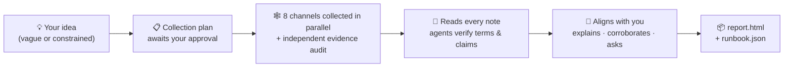

<h1 align="center">🔍 research-anything</h1>

<p align="center"><b>Give it an idea. Get back a plan.</b></p>

<p align="center">An all-channel research skill for Claude Code — it sweeps 8 channels for first-hand practices, dispatches sub agents to verify what it doesn't know, and converges everything into <b>one actionable plan that fits your situation</b> — not a laundry list of options.</p>

<p align="center">
  <a href="README.md">English</a> •
  <a href="README_CN.md">简体中文</a> •
  <a href="README_JA.md">日本語</a> •
  <a href="README_KO.md">한국어</a> •
  <a href="README_ES.md">Español</a> •
  <a href="README_FR.md">Français</a> •
  <a href="README_DE.md">Deutsch</a> •
  <a href="README_PT.md">Português</a> •
  <a href="README_RU.md">Русский</a>
</p>

<p align="center">
  
  
  
  
  
</p>

<p align="center">
  <a href="#-why-its-different-from-ai-go-search-for-me">Why it's different</a> •
  <a href="#-how-a-research-run-unfolds">How it works</a> •
  <a href="#-quick-start">Quick start</a> •
  <a href="#-first-time-setup-once">First-time setup</a> •
  <a href="#-usage">Usage</a> •
  <a href="#-what-each-channel-yields">Channels</a> •
  <a href="#-faq">FAQ</a>
</p>

---

> **The state of the art shouldn't stay locked inside feeds you never scroll.**
> The practices that actually work are scattered across Douyin and Xiaohongshu videos, Bilibili deep-dive reviews, Zhihu long-form answers, GitHub issues, and X threads — places ordinary web search can't reach, and where AI training data has long gone stale. Build in isolation and you often find out too late that your approach is generations behind.
>
> research-anything hardens the whole pipeline — **sweep every channel → verify the evidence → converge on a plan** — into a single Claude Code skill. One sentence to trigger, 30–60 minutes to finish.

📱 Douyin · 📕 Xiaohongshu (RED) · 💬 Zhihu · 📺 Bilibili · ▶️ YouTube · 🐙 GitHub · 🐦 Twitter(X) · 🌐 General web

## ✨ Why it's different from "AI, go search for me"

| | The usual "AI, do some research" | research-anything |
|---|---|---|
| **Sources** | Stale training data + a few shallow web searches | First-hand content from 8 channels, including short-video and community posts that web search can't reach |
| **Videos & images** | Can't watch them; reads titles and blurbs only | Pulls subtitles / transcribes full speech, OCRs images, captures top comments — everything enters the evidence |
| **Unfamiliar terms** | Guesses from the surface | Dispatches one sub agent per term to verify it (what it is / who made it / when it shipped / what it supersedes), then assembles a generational timeline of the field |
| **Key numbers & claims** | Repeats them, true or not | Spot-checks each one: facts against official sources, quality claims against independent word-of-mouth; vendor self-praise gets labeled; the unverifiable is marked "unverified" |
| **When your needs are vague** | Interrogates you about goals and budget upfront | Surveys the landscape first, then comes back with real information to help you figure out what you actually need |
| **Final deliverable** | N parallel options — you still have to choose | **One** default path + switch conditions, down to step/command level, every conclusion cited |

Two of those, expanded:

**🧠 It knows what it doesn't know — and goes to fill the gaps.** The most common failure of AI research is training data frozen in the past: recommending an approach that's generations behind without realizing it. While reading through its notes, research-anything dispatches an independent sub agent for every unfamiliar term, new tool, or new model (including things newer than its training data) to verify it on the spot, then orders everything by release date into a generational timeline — before recommending anything, it checks which generation that thing stands on.

**🌫️→🎯 Requirements can come in vague and leave sharp.** Both of these work:

> 😶‍🌫️ Vague: "A weekend 3-day, 2-night Beijing itinerary"
>
> 📋 Constrained: "A weekend 3-day, 2-night Beijing itinerary — 3 adults + a 2-year-old + an 80-year-old, self-driving, hotel budget under ¥1,000 per room per night"

Given a vague request, it won't interrogate you upfront (you can't answer well yet anyway). It surveys what's out there first, then comes back to align with you: it explains every term that will appear in the plan, lists the key conclusions independently corroborated by multiple sources, and asks only the few questions that genuinely change the trade-offs. **The research process itself helps you figure out what you need.**

## 🔄 How a research run unfolds



From the moment you state your idea: it first confirms one thing only — that it hasn't misread the research direction — without grilling you on goals and budgets you can't answer yet. Then it hands you a **collection plan** (channels × keywords × depth × estimated time/cost). Once you tweak and approve it, 8 channels start in parallel: one collector agent per channel searches for real content and files distilled notes to disk, then an independent audit agent completes the evidence item by item — video transcripts, top comments, image text, open-source licenses. Anything below the bar gets caught by validators and redone, never silently fudged.

After collection, the main agent personally reads every note, dispatching a swarm of sub agents in parallel to verify unfamiliar terms and load-bearing claims. Before proposing anything it explains first, asks second: a glossary walkthrough, the cross-corroborated conclusions, and a few key trade-off questions. Finally it writes two deliverables into your project — a report for humans and a runbook for AI — with every conclusion traceable back to its source post.

## 🚀 Quick start

**Prerequisites**: You already use [Claude Code](https://claude.com/claude-code) (the skill relies on its sub-agent / Workflow orchestration); macOS (tested).

Paste the whole block below to Claude Code (or Codex) and let it do the legwork:

```text
Please install and configure research-anything (a Claude Code research skill) step by step:

1. Clone the skill itself:
   git clone https://github.com/Somezak1/research-anything.git ~/.claude/skills/research-anything

2. Create the tools directory ~/tools/ and install the collectors
   (the skill's docs assume every tool lives under ~/tools/):
   - git clone https://github.com/NanmiCoder/MediaCrawler.git ~/tools/MediaCrawler
     and install its dependencies with uv per its README
     (used to collect Douyin / Xiaohongshu / Zhihu / Bilibili)
   - Install yt-dlp: brew install yt-dlp (for YouTube/Bilibili subtitle fetching)

3. Make sure Claude Code has the GitHub MCP (official github plugin / MCP server)
   configured; set it up if not
   (the GitHub channel relies on it to search repos and read READMEs and LICENSEs)

4. (Optional — only if you want the Twitter channel) Create a dedicated uv venv under
   ~/tools/twscrape and install twscrape (https://github.com/vladkens/twscrape)

5. (Optional — fast Xiaohongshu search) Install https://github.com/xpzouying/xiaohongshu-mcp
   to ~/tools/xiaohongshu-mcp and register it in Claude Code's MCP config
   (skipping is fine: Xiaohongshu falls back to MediaCrawler)

When done, report success/failure item by item, and tell me how to fix the failures manually.
```

> 💡 The tools directory must be `~/tools/` (every command in the skill's docs is written against it). Already installed elsewhere? Just symlink: `ln -s <your tools dir> ~/tools`.

## 🔑 First-time setup (once)

These steps involve QR-code logins and account credentials — the AI can't stand in for you, but each is one-time:

| Step | What to do | If skipped |
|---|---|---|
| 📲 Four-platform login (**required**) | Under `~/tools/MediaCrawler`, run one search per platform (e.g. `uv run main.py --platform xhs --type search --keywords "test"`) and scan the QR code in the browser it opens. Login state persists; runs unattended afterwards | Those platforms fail to collect |
| 🐦 Twitter (optional) | Use a **burner account** (never your main), log in via browser, grab the `auth_token` + `ct0` cookies, then run `~/tools/twscrape/.venv/bin/twscrape add_cookie <user> 'auth_token=...; ct0=...'` | Twitter channel reports failure; everything else runs |
| 📺 Bilibili subtitle cookie (optional) | Export your Bilibili cookies to `~/tools/bili_cookies.txt` (Netscape format, e.g. via the Get cookies.txt LOCALLY extension) | Bilibili videos fall back to paid transcription or report failure |
| 🎙️ Paid speech-to-text (optional) | Enable fun-asr on Alibaba Cloud Bailian (~¥0.8/hour, free tier included), then add `export DASHSCOPE_API_KEY=your_key` to `~/.zshrc` | Douyin/Xiaohongshu videos can't be transcribed; text and comments only |

Every optional item follows one principle: **whatever is missing, the corresponding capability degrades honestly and is disclosed in the report — never silently papered over.**

## 🎬 Usage

Open Claude Code in any project and just say what you're thinking — it triggers automatically:

> 💬 I want to make AI comic dramas — research the mature approaches on the market

> 💬 A weekend 3-day, 2-night Beijing itinerary — 3 adults + a 2-year-old + an 80-year-old, self-driving, hotel budget under ¥1,000 per room per night

When the run finishes, you'll find under `docs/research/<topic>/` in your project:

| Deliverable | Purpose |
|---|---|
| 📄 `report.html` | For humans: executive summary, generational timeline, per-channel landscape, default plan + switch conditions, comparison matrix, all sources |
| 🤖 `runbook.json` | For AI: command-level steps, fallback conditions, verified / unverified / to-test lists |
| 🗂️ `raw/` `verify/` `qa.md` | Every raw note, verification verdict, and Q&A transcript — every conclusion traces back to its source |

## 🕸️ What each channel yields

| Channel | Collector | Evidence captured |
|---|---|---|
| 📱 Douyin | MediaCrawler | Full speech transcripts + top comments + engagement metrics |
| 📕 Xiaohongshu | MediaCrawler / xiaohongshu-mcp | Post text + image OCR + video transcripts + top comments |
| 💬 Zhihu | MediaCrawler | Full answers/articles (hundreds to tens of thousands of words) + top comments |
| 📺 Bilibili | MediaCrawler + yt-dlp | AI subtitle full text (free) / transcription + top comments + danmaku heat |
| ▶️ YouTube | yt-dlp | Subtitle full text, fetched directly (free) + comments |
| 🐙 GitHub | GitHub MCP | README actually read + stars/activity + **real root-level LICENSE check** + issue mining |
| 🐦 Twitter(X) | twscrape | Tweets + threads + reply text + video subtitles/transcription |
| 🌐 General web | WebSearch / tavily | Official docs, pricing pages, long-form comparisons (for cross-validation) |

## ❓ FAQ

**Does it cost money?** The only step that can cost anything is optional paid speech-to-text (~¥0.8/hour), and it never runs without your explicit approval of a numeric cap. Everything else is free (it runs on the Claude Code subscription you already have).

**What if a channel is unreachable or unconfigured?** Honest degradation: that channel reports its failure reason, the rest keep running, and the report's appendix discloses hit/failure counts per channel and per keyword — coverage is never silently faked.

**Windows / Linux?** Only macOS is tested so far (image OCR uses a macOS system capability). Other platforms need a replacement OCR script — PRs welcome.

**Is it compliant?** Collected content is for personal research only; respect each platform's terms of service. The skill has built-in rate-limiting and anti-risk constraints; use a burner account for Twitter. All login state, cookies, and API keys stay on your machine — **this repository contains no credentials**.

## 🙏 Standing on the shoulders of

| Project | Role here |
|---|---|
| [NanmiCoder/MediaCrawler](https://github.com/NanmiCoder/MediaCrawler) | Douyin / Xiaohongshu / Zhihu / Bilibili collection |
| [vladkens/twscrape](https://github.com/vladkens/twscrape) | Twitter/X search and reply capture |
| [yt-dlp/yt-dlp](https://github.com/yt-dlp/yt-dlp) | YouTube / Bilibili subtitle fetching and video download |
| [xpzouying/xiaohongshu-mcp](https://github.com/xpzouying/xiaohongshu-mcp) | Fast Xiaohongshu search (optional) |
| Alibaba Cloud Bailian fun-asr | Video speech transcription (optional, pay-as-you-go) |

## 📁 Repository layout

```
research-anything/
├── SKILL.md               # Skill entry: pipeline and iron rules
├── references/            # Stage-by-stage procedures + 8 channel playbooks
│   └── channels/
└── scripts/               # Collection orchestration, log validation, ASR/OCR, report assets (with tests)
```

---

<p align="center">If this is useful, drop a ⭐ so more people can find it.</p>
