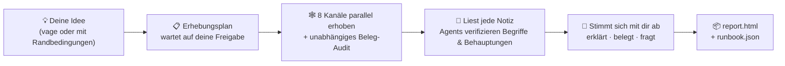

<h1 align="center">🔍 research-anything</h1>

<p align="center"><b>Gib ihm eine Idee. Bekomm einen Plan zurück.</b></p>

<p align="center">Ein Recherche-Skill für Claude Code, der alle Kanäle abdeckt — er durchkämmt 8 Kanäle nach Praxiswissen aus erster Hand, schickt Sub-Agents los, um zu verifizieren, was er nicht weiß, und verdichtet alles zu <b>einem umsetzbaren Plan, der zu deiner Situation passt</b> — und nicht zu einer endlosen Optionsliste.</p>

<p align="center">
  <a href="README.md"></a>
  <a href="README_CN.md"></a>
  <a href="README_JA.md"></a>
  <a href="README_KO.md"></a>
  <a href="README_ES.md"></a>
  <a href="README_FR.md"></a>
  <a href="README_DE.md"></a>
  <a href="README_PT.md"></a>
  <a href="README_RU.md"></a>
</p>

<p align="center">
  
  
  
  
  
</p>

<p align="center">
  <a href="#-warum-es-anders-ist-als-ki-such-mal-für-mich">Warum es anders ist</a> •
  <a href="#-so-läuft-ein-recherche-durchlauf-ab">So funktioniert es</a> •
  <a href="#-schnellstart">Schnellstart</a> •
  <a href="#-ersteinrichtung-einmalig">Ersteinrichtung</a> •
  <a href="#-verwendung">Verwendung</a> •
  <a href="#-was-jeder-kanal-liefert">Kanäle</a> •
  <a href="#-faq">FAQ</a>
</p>

---

> **Der Stand der Technik sollte nicht in Feeds eingeschlossen bleiben, durch die du nie scrollst.**
> Die Praktiken, die wirklich funktionieren, sind verstreut über Douyin- und Xiaohongshu-Videos, ausführliche Bilibili-Reviews, lange Zhihu-Antworten, GitHub-Issues und X-Threads — Orte, die gewöhnliche Websuche nicht erreicht und an denen KI-Trainingsdaten längst veraltet sind. Wer im stillen Kämmerlein baut, merkt oft zu spät, dass sein Ansatz Generationen hinterherhinkt.
>
> research-anything gießt die gesamte Pipeline — **alle Kanäle durchkämmen → die Belege verifizieren → auf einen Plan verdichten** — in einen einzigen Claude-Code-Skill. Ein Satz zum Auslösen, 30–60 Minuten bis zum Ergebnis.

<p align="center">📱 Douyin · 📕 Xiaohongshu (RED) · 💬 Zhihu · 📺 Bilibili · ▶️ YouTube · 🐙 GitHub · 🐦 Twitter(X) · 🌐 Allgemeines Web</p>

## ✨ Warum es anders ist als „KI, such mal für mich“

| | Das übliche „KI, recherchier mal“ | research-anything |
|---|---|---|
| **Quellen** | Veraltete Trainingsdaten + ein paar oberflächliche Websuchen | Inhalte aus erster Hand aus 8 Kanälen, darunter Kurzvideos und Community-Beiträge, die Websuche nicht erreicht |
| **Videos & Bilder** | Kann sie nicht ansehen; liest nur Titel und Anreißer | Lädt Untertitel / transkribiert die komplette Tonspur, liest Bildtext per OCR aus, erfasst Top-Kommentare — alles fließt in die Beweislage ein |
| **Unbekannte Begriffe** | Rät anhand der Oberfläche | Schickt pro Begriff einen eigenen Sub-Agent zur Verifikation los (was es ist / wer es gebaut hat / wann es erschien / was es ablöst) und fügt daraus eine Generationen-Zeitleiste des Feldes zusammen |
| **Kernzahlen & Behauptungen** | Wiederholt sie, ob wahr oder nicht | Prüft jede einzelne stichprobenartig: Fakten gegen offizielle Quellen, Qualitätsbehauptungen gegen unabhängige Erfahrungsberichte; Eigenlob der Anbieter wird als solches gekennzeichnet; Unbelegbares wird als „unverifiziert“ markiert |
| **Wenn dein Bedarf vage ist** | Löchert dich vorab mit Fragen zu Zielen und Budget | Sondiert erst das Terrain und kommt dann mit echten Informationen zurück, damit du herausfinden kannst, was du wirklich brauchst |
| **Endergebnis** | N parallele Optionen — wählen musst du trotzdem selbst | **Ein** Standardweg + Wechselbedingungen, bis auf Schritt-/Befehlsebene, jede Schlussfolgerung mit Quellenangabe |

Zwei davon, näher ausgeführt:

**🧠 Es weiß, was es nicht weiß — und geht los, um die Lücken zu füllen.** Der häufigste Fehler von KI-Recherche sind in der Vergangenheit eingefrorene Trainingsdaten: Empfohlen wird ein Ansatz, der Generationen zurückliegt — ohne dass die KI es merkt. Während research-anything seine Notizen durcharbeitet, schickt es für jeden unbekannten Begriff, jedes neue Tool und jedes neue Modell (auch Dinge, die jünger sind als seine Trainingsdaten) einen unabhängigen Sub-Agent los, der es an Ort und Stelle verifiziert, und ordnet dann alles nach Erscheinungsdatum zu einer Generationen-Zeitleiste — bevor es irgendetwas empfiehlt, prüft es, auf welcher Generation das Betreffende steht.

**🌫️→🎯 Anforderungen dürfen vage hereinkommen und gehen geschärft wieder raus.** Beides funktioniert:

> 😶‍🌫️ Vage: „Eine Peking-Reiseroute fürs Wochenende, 3 Tage, 2 Nächte“
>
> 📋 Mit Randbedingungen: „Eine Peking-Reiseroute fürs Wochenende, 3 Tage, 2 Nächte — 3 Erwachsene + ein 2-jähriges Kind + eine 80-jährige Person, mit dem eigenen Auto, Hotelbudget unter ¥1,000 pro Zimmer und Nacht“

Bei einer vagen Anfrage löchert es dich nicht vorab mit Fragen (die du ohnehin noch nicht gut beantworten kannst). Es sichtet zuerst, was es da draußen gibt, und kommt dann zur Abstimmung zurück: Es erklärt jeden Begriff, der im Plan auftauchen wird, listet die Kernschlussfolgerungen auf, die von mehreren Quellen unabhängig bestätigt werden, und stellt nur die wenigen Fragen, die die Abwägungen wirklich verändern. **Der Rechercheprozess selbst hilft dir herauszufinden, was du brauchst.**

## 🔄 So läuft ein Recherche-Durchlauf ab



Von dem Moment an, in dem du deine Idee nennst: Zuerst vergewissert es sich nur eines Punktes — dass es die Rechercherichtung nicht missverstanden hat — ohne dich zu Zielen und Budgets auszufragen, die du noch gar nicht beantworten kannst. Dann legt es dir einen **Erhebungsplan** vor (Kanäle × Suchbegriffe × Tiefe × geschätzte Zeit/Kosten). Sobald du ihn angepasst und freigegeben hast, starten 8 Kanäle parallel: Pro Kanal sucht ein Sammel-Agent nach echten Inhalten und legt destillierte Notizen auf der Festplatte ab, dann vervollständigt ein unabhängiger Audit-Agent die Belege Stück für Stück — Videotranskripte, Top-Kommentare, Bildtexte, Open-Source-Lizenzen. Alles, was unter der Messlatte bleibt, wird von Validatoren abgefangen und neu gemacht — niemals stillschweigend zurechtgebogen.

Nach der Erhebung liest der Haupt-Agent jede Notiz persönlich und schickt parallel einen Schwarm von Sub-Agents los, um unbekannte Begriffe und tragende Behauptungen zu verifizieren. Bevor er irgendetwas vorschlägt, erklärt er zuerst und fragt dann: ein Glossar-Durchgang, die quellenübergreifend bestätigten Schlussfolgerungen und ein paar zentrale Abwägungsfragen. Zum Schluss schreibt er zwei Ergebnisartefakte in dein Projekt — einen Report für Menschen und ein Runbook für die KI — wobei jede Schlussfolgerung bis zum ursprünglichen Beitrag zurückverfolgbar ist.

## 🚀 Schnellstart

**Voraussetzungen**: Du nutzt bereits [Claude Code](https://claude.com/claude-code) (der Skill stützt sich auf dessen Sub-Agent-/Workflow-Orchestrierung); macOS (getestet).

Füge den kompletten Block unten in Claude Code (oder Codex) ein und lass es die Fleißarbeit erledigen:

```text
Bitte installiere und konfiguriere research-anything (einen Recherche-Skill für Claude Code) Schritt für Schritt:

1. Klone den Skill selbst:
   git clone https://github.com/Somezak1/research-anything.git ~/.claude/skills/research-anything

2. Lege das Tool-Verzeichnis ~/tools/ an und installiere die Collector
   (die Doku des Skills geht davon aus, dass jedes Tool unter ~/tools/ liegt):
   - git clone https://github.com/NanmiCoder/MediaCrawler.git ~/tools/MediaCrawler
     und installiere seine Abhängigkeiten mit uv gemäß seiner README
     (dient der Erhebung von Douyin / Xiaohongshu / Zhihu / Bilibili)
   - Installiere yt-dlp: brew install yt-dlp (für den Untertitel-Abruf von YouTube/Bilibili)

3. Stelle sicher, dass in Claude Code das GitHub MCP (offizielles github-Plugin / MCP-Server)
   konfiguriert ist; richte es andernfalls ein
   (der GitHub-Kanal braucht es, um Repos zu durchsuchen und READMEs sowie LICENSEs zu lesen)

4. (Optional — nur wenn du den Twitter-Kanal willst) Lege ein eigenes uv-venv unter
   ~/tools/twscrape an und installiere twscrape (https://github.com/vladkens/twscrape)

5. (Optional — schnelle Xiaohongshu-Suche) Installiere https://github.com/xpzouying/xiaohongshu-mcp
   nach ~/tools/xiaohongshu-mcp und registriere es in der MCP-Konfiguration von Claude Code
   (Überspringen ist okay: Xiaohongshu fällt dann auf MediaCrawler zurück)

Berichte am Ende Punkt für Punkt über Erfolg/Misserfolg und sag mir, wie ich die Fehlschläge manuell behebe.
```

> 💡 Das Tool-Verzeichnis muss `~/tools/` sein (jeder Befehl in der Doku des Skills ist darauf ausgelegt). Schon woanders installiert? Einfach einen Symlink setzen: `ln -s <your tools dir> ~/tools`.

## 🔑 Ersteinrichtung (einmalig)

Diese Schritte umfassen QR-Code-Logins und Zugangsdaten — hier kann die KI nicht für dich einspringen, aber jeder Schritt ist nur einmal nötig:

| Schritt | Was zu tun ist | Wenn übersprungen |
|---|---|---|
| 📲 Login auf vier Plattformen (**erforderlich**) | Führe unter `~/tools/MediaCrawler` pro Plattform eine Suche aus (z. B. `uv run main.py --platform xhs --type search --keywords "test"`) und scanne den QR-Code im Browser, der sich öffnet. Der Login-Zustand bleibt erhalten; danach läuft alles unbeaufsichtigt | Diese Plattformen scheitern bei der Erhebung |
| 🐦 Twitter (optional) | Nutze ein **Wegwerf-Konto** (niemals dein Hauptkonto), melde dich im Browser an, hole die Cookies `auth_token` + `ct0` und führe dann `~/tools/twscrape/.venv/bin/twscrape add_cookie <user> 'auth_token=...; ct0=...'` aus | Der Twitter-Kanal meldet einen Fehlschlag; alles andere läuft weiter |
| 📺 Bilibili-Untertitel-Cookie (optional) | Exportiere deine Bilibili-Cookies nach `~/tools/bili_cookies.txt` (Netscape-Format, z. B. mit der Erweiterung „Get cookies.txt LOCALLY“) | Bilibili-Videos fallen auf kostenpflichtige Transkription zurück oder melden einen Fehlschlag |
| 🎙️ Kostenpflichtiges Speech-to-Text (optional) | Aktiviere fun-asr auf Alibaba Cloud Bailian (~¥0.8/Stunde, Freikontingent inklusive) und füge `export DASHSCOPE_API_KEY=your_key` zu `~/.zshrc` hinzu | Douyin-/Xiaohongshu-Videos können nicht transkribiert werden; nur Text und Kommentare |

Für jeden optionalen Punkt gilt dasselbe Prinzip: **Was auch immer fehlt — die entsprechende Fähigkeit degradiert ehrlich und wird im Report offengelegt, niemals stillschweigend übertüncht.**

## 🎬 Verwendung

Öffne Claude Code in einem beliebigen Projekt und sag einfach, was dir vorschwebt — der Skill wird automatisch ausgelöst:

> 💬 Ich will KI-Comic-Dramen machen — recherchiere die ausgereiften Ansätze auf dem Markt

> 💬 Eine Peking-Reiseroute fürs Wochenende, 3 Tage, 2 Nächte — 3 Erwachsene + ein 2-jähriges Kind + eine 80-jährige Person, mit dem eigenen Auto, Hotelbudget unter ¥1,000 pro Zimmer und Nacht

Wenn der Durchlauf abgeschlossen ist, findest du unter `docs/research/<thema>/` in deinem Projekt:

| Artefakt | Zweck |
|---|---|
| 📄 `report.html` | Für Menschen: Executive Summary, Generationen-Zeitleiste, Landschaft pro Kanal, Standardplan + Wechselbedingungen, Vergleichsmatrix, alle Quellen |
| 🤖 `runbook.json` | Für die KI: Schritte auf Befehlsebene, Fallback-Bedingungen, Listen mit Verifiziertem / Unverifiziertem / noch zu Testendem |
| 🗂️ `raw/` `verify/` `qa.md` | Jede Rohnotiz, jedes Verifikationsurteil und das Q&A-Protokoll — jede Schlussfolgerung lässt sich zur Quelle zurückverfolgen |

## 🕸️ Was jeder Kanal liefert

| Kanal | Sammler | Erfasste Belege |
|---|---|---|
| 📱 Douyin | MediaCrawler | Vollständige Sprachtranskripte + Top-Kommentare + Engagement-Metriken |
| 📕 Xiaohongshu | MediaCrawler / xiaohongshu-mcp | Beitragstext + Bild-OCR + Videotranskripte + Top-Kommentare |
| 💬 Zhihu | MediaCrawler | Vollständige Antworten/Artikel (Hunderte bis Zehntausende Wörter) + Top-Kommentare |
| 📺 Bilibili | MediaCrawler + yt-dlp | Kompletter KI-Untertiteltext (kostenlos) / Transkription + Top-Kommentare + Danmaku-Aufkommen |
| ▶️ YouTube | yt-dlp | Kompletter Untertiteltext, direkt abgerufen (kostenlos) + Kommentare |
| 🐙 GitHub | GitHub MCP | Tatsächlich gelesene README + Stars/Aktivität + **echter LICENSE-Check im Root-Verzeichnis** + Issue-Mining |
| 🐦 Twitter(X) | twscrape | Tweets + Threads + Antworttexte + Video-Untertitel/Transkription |
| 🌐 Allgemeines Web | WebSearch / tavily | Offizielle Doku, Preisseiten, ausführliche Vergleiche (zur Kreuzvalidierung) |

## ❓ FAQ

**Kostet es Geld?** Der einzige Schritt, der etwas kosten kann, ist das optionale kostenpflichtige Speech-to-Text (~¥0.8/Stunde), und es läuft nie ohne deine ausdrückliche Freigabe einer bezifferten Obergrenze. Alles andere ist kostenlos (es läuft über das Claude-Code-Abo, das du ohnehin schon hast).

**Was, wenn ein Kanal nicht erreichbar oder nicht konfiguriert ist?** Ehrliche Degradierung: Dieser Kanal meldet seinen Fehlergrund, die übrigen laufen weiter, und der Anhang des Reports legt die Treffer-/Fehlschlagzahlen pro Kanal und pro Suchbegriff offen — Abdeckung wird niemals stillschweigend vorgetäuscht.

**Windows / Linux?** Bisher ist nur macOS getestet (die Bild-OCR nutzt eine macOS-Systemfunktion). Andere Plattformen brauchen ein Ersatz-OCR-Skript — PRs willkommen.

**Ist das regelkonform?** Erhobene Inhalte sind nur für die persönliche Recherche gedacht; halte dich an die Nutzungsbedingungen der jeweiligen Plattform. Der Skill hat eingebaute Rate-Limits und Schutzmechanismen gegen Sperr-Risiken; nutze für Twitter ein Wegwerf-Konto. Sämtliche Login-Zustände, Cookies und API-Keys bleiben auf deinem Rechner — **dieses Repository enthält keinerlei Zugangsdaten**.

## 🙏 Auf den Schultern von

| Projekt | Rolle hier |
|---|---|
| [NanmiCoder/MediaCrawler](https://github.com/NanmiCoder/MediaCrawler) | Erhebung von Douyin / Xiaohongshu / Zhihu / Bilibili |
| [vladkens/twscrape](https://github.com/vladkens/twscrape) | Twitter/X-Suche und Erfassung von Antworten |
| [yt-dlp/yt-dlp](https://github.com/yt-dlp/yt-dlp) | Untertitel-Abruf und Video-Download für YouTube / Bilibili |
| [xpzouying/xiaohongshu-mcp](https://github.com/xpzouying/xiaohongshu-mcp) | Schnelle Xiaohongshu-Suche (optional) |
| Alibaba Cloud Bailian fun-asr | Sprachtranskription von Videos (optional, nutzungsbasiert abgerechnet) |

## 📁 Aufbau des Repositorys

```
research-anything/
├── SKILL.md               # Skill-Einstieg: Pipeline und eherne Regeln
├── references/            # Vorgehen Stufe für Stufe + 8 Kanal-Playbooks
│   └── channels/
└── scripts/               # Erhebungs-Orchestrierung, Log-Validierung, ASR/OCR, Report-Assets (mit Tests)
```

---

<p align="center">Wenn dir das nützt, lass ein ⭐ da, damit mehr Leute es finden.</p>
