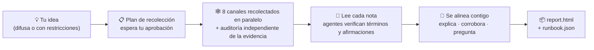

<h1 align="center">🔍 research-anything</h1>

<p align="center"><b>Dale una idea. Recibe un plan.</b></p>

<p align="center">Una skill de investigación omnicanal para Claude Code: barre 8 canales en busca de prácticas de primera mano, despacha subagentes para verificar lo que no sabe y hace converger todo en <b>un único plan accionable que se ajusta a tu situación</b>, no en una lista interminable de opciones.</p>

<p align="center">
  <a href="README.md"></a>
  <a href="README_CN.md"></a>
  <a href="README_JA.md"></a>
  <a href="README_KO.md"></a>
  <a href="README_ES.md"></a>
  <a href="README_FR.md"></a>
  <a href="README_DE.md"></a>
  <a href="README_PT.md"></a>
  <a href="README_RU.md"></a>
</p>

<p align="center">
  <a href="#-por-qué-es-diferente-de-ia-busca-por-mí">Por qué es diferente</a> •
  <a href="#-cómo-se-desarrolla-una-investigación">Cómo funciona</a> •
  <a href="#-inicio-rápido">Inicio rápido</a> •
  <a href="#-configuración-inicial-una-sola-vez">Configuración inicial</a> •
  <a href="#-uso">Uso</a> •
  <a href="#-qué-aporta-cada-canal">Canales</a> •
  <a href="#-preguntas-frecuentes">Preguntas frecuentes</a>
</p>

---

> **El estado del arte no debería quedarse encerrado en feeds por los que nunca te desplazas.**
> Las prácticas que de verdad funcionan están dispersas en vídeos de Douyin y Xiaohongshu, reseñas a fondo de Bilibili, respuestas extensas de Zhihu, issues de GitHub e hilos de X: lugares a los que la búsqueda web corriente no llega y donde los datos de entrenamiento de la IA llevan tiempo desfasados. Si construyes aislado, a menudo descubres demasiado tarde que tu enfoque va generaciones por detrás.
>
> research-anything consolida todo el pipeline — **barrer todos los canales → verificar la evidencia → converger en un plan** — en una sola skill de Claude Code. Una frase para activarla, 30–60 minutos para terminar.

<p align="center">📱 Douyin · 📕 Xiaohongshu (RED) · 💬 Zhihu · 📺 Bilibili · ▶️ YouTube · 🐙 GitHub · 🐦 Twitter(X) · 🌐 Web general</p>

## ✨ Por qué es diferente de "IA, busca por mí"

| | El típico "IA, investiga un poco" | research-anything |
|---|---|---|
| **Fuentes** | Datos de entrenamiento desfasados + unas pocas búsquedas web superficiales | Contenido de primera mano de 8 canales, incluidos vídeos cortos y publicaciones de comunidades a los que la búsqueda web no llega |
| **Vídeos e imágenes** | No puede verlos; solo lee títulos y descripciones | Extrae subtítulos / transcribe el audio completo, aplica OCR a las imágenes, captura los comentarios destacados — todo entra en la evidencia |
| **Términos desconocidos** | Adivina por la superficie | Despacha un subagente por término para verificarlo (qué es / quién lo hizo / cuándo salió / a qué reemplaza) y luego arma una línea de tiempo generacional del campo |
| **Cifras y afirmaciones clave** | Las repite, sean ciertas o no | Verifica cada una por muestreo: los hechos contra fuentes oficiales, las afirmaciones de calidad contra opiniones independientes; la autopromoción del fabricante se etiqueta; lo no verificable se marca como "sin verificar" |
| **Cuando tus necesidades son vagas** | Te interroga de entrada sobre objetivos y presupuesto | Primero explora el panorama y luego vuelve con información real para ayudarte a descubrir qué necesitas en realidad |
| **Entregable final** | N opciones en paralelo — aún tienes que elegir | **Un** camino por defecto + condiciones de cambio, hasta el nivel de paso/comando, cada conclusión con su cita |

Dos de esos puntos, en detalle:

**🧠 Sabe lo que no sabe — y va a llenar esos huecos.** El fallo más común de la investigación con IA son los datos de entrenamiento congelados en el pasado: recomendar un enfoque que va generaciones por detrás sin darse cuenta. Mientras repasa sus notas, research-anything despacha un subagente independiente por cada término desconocido, herramienta nueva o modelo nuevo (incluidas cosas más recientes que sus datos de entrenamiento) para verificarlo en el momento, y después lo ordena todo por fecha de lanzamiento en una línea de tiempo generacional: antes de recomendar nada, comprueba sobre qué generación se apoya esa cosa.

**🌫️→🎯 Los requisitos pueden entrar difusos y salir nítidos.** Ambos funcionan:

> 😶‍🌫️ Difuso: "Un itinerario de fin de semana de 3 días y 2 noches por Pekín"
>
> 📋 Con restricciones: "Un itinerario de fin de semana de 3 días y 2 noches por Pekín — 3 adultos + un niño de 2 años + una persona de 80, en coche propio, presupuesto de hotel por debajo de ¥1,000 por habitación y noche"

Ante una petición difusa, no te interroga de entrada (todavía no sabrías responder bien). Primero explora lo que hay ahí fuera y luego vuelve para alinearse contigo: explica cada término que aparecerá en el plan, enumera las conclusiones clave corroboradas de forma independiente por varias fuentes y hace solo las pocas preguntas que de verdad cambian las decisiones de compromiso. **El propio proceso de investigación te ayuda a descubrir qué necesitas.**

## 🔄 Cómo se desarrolla una investigación



Desde el momento en que expresas tu idea: primero confirma una sola cosa — que no ha malinterpretado la dirección de la investigación — sin acribillarte con preguntas sobre objetivos y presupuestos que aún no puedes responder. Luego te entrega un **plan de recolección** (canales × palabras clave × profundidad × tiempo/coste estimados). En cuanto lo ajustas y lo apruebas, los 8 canales arrancan en paralelo: un agente recolector por canal busca contenido real y guarda notas destiladas en disco, y después un agente auditor independiente completa la evidencia pieza por pieza — transcripciones de vídeo, comentarios destacados, texto de las imágenes, licencias de código abierto. Todo lo que no llega al listón lo detectan los validadores y se rehace; nunca se maquilla en silencio.

Terminada la recolección, el agente principal lee personalmente cada nota y despacha en paralelo un enjambre de subagentes para verificar los términos desconocidos y las afirmaciones que sostienen el plan. Antes de proponer nada, primero explica y después pregunta: un repaso del glosario, las conclusiones corroboradas por varias fuentes y unas pocas preguntas clave sobre las decisiones de compromiso. Por último escribe dos entregables en tu proyecto — un informe para humanos y un runbook para la IA — con cada conclusión trazable hasta su publicación de origen.

## 🚀 Inicio rápido

**Requisitos previos**: Ya usas [Claude Code](https://claude.com/claude-code) (la skill depende de su orquestación de subagentes / Workflows); macOS (probado).

Pega el bloque completo de abajo en Claude Code (o Codex) y deja que él haga el trabajo pesado:

```text
Por favor, instala y configura research-anything (una skill de investigación de Claude Code) paso a paso:

1. Clona la skill en sí:
   git clone https://github.com/Somezak1/research-anything.git ~/.claude/skills/research-anything

2. Crea el directorio de herramientas ~/tools/ e instala los recolectores
   (la documentación de la skill asume que todas las herramientas viven bajo ~/tools/):
   - git clone https://github.com/NanmiCoder/MediaCrawler.git ~/tools/MediaCrawler
     e instala sus dependencias con uv según su README
     (se usa para recolectar Douyin / Xiaohongshu / Zhihu / Bilibili)
   - Instala yt-dlp: brew install yt-dlp (para obtener subtítulos de YouTube/Bilibili)

3. Asegúrate de que Claude Code tenga configurado el MCP de GitHub (plugin oficial de
   github / servidor MCP); configúralo si no lo está
   (el canal de GitHub depende de él para buscar repositorios y leer los README y LICENSE)

4. (Opcional — solo si quieres el canal de Twitter) Crea un venv de uv dedicado bajo
   ~/tools/twscrape e instala twscrape (https://github.com/vladkens/twscrape)

5. (Opcional — búsqueda rápida en Xiaohongshu) Instala https://github.com/xpzouying/xiaohongshu-mcp
   en ~/tools/xiaohongshu-mcp y regístralo en la configuración MCP de Claude Code
   (se puede omitir: Xiaohongshu recurre a MediaCrawler como alternativa)

Al terminar, informa del éxito/fallo punto por punto y dime cómo arreglar los fallos manualmente.
```

> 💡 El directorio de herramientas debe ser `~/tools/` (todos los comandos de la documentación de la skill están escritos contra esa ruta). ¿Ya lo tienes instalado en otro sitio? Basta un enlace simbólico: `ln -s <your tools dir> ~/tools`.

## 🔑 Configuración inicial (una sola vez)

Estos pasos implican inicios de sesión con código QR y credenciales de cuentas — la IA no puede hacerlos por ti, pero cada uno se hace una sola vez:

| Paso | Qué hacer | Si se omite |
|---|---|---|
| 📲 Inicio de sesión en las cuatro plataformas (**obligatorio**) | En `~/tools/MediaCrawler`, ejecuta una búsqueda por plataforma (p. ej. `uv run main.py --platform xhs --type search --keywords "test"`) y escanea el código QR en el navegador que se abre. La sesión persiste; después funciona sin supervisión | Esas plataformas fallan al recolectar |
| 🐦 Twitter (opcional) | Usa una **cuenta desechable** (nunca tu cuenta principal), inicia sesión por navegador, obtén las cookies `auth_token` + `ct0` y luego ejecuta `~/tools/twscrape/.venv/bin/twscrape add_cookie <user> 'auth_token=...; ct0=...'` | El canal de Twitter reporta fallo; todo lo demás funciona |
| 📺 Cookie de subtítulos de Bilibili (opcional) | Exporta tus cookies de Bilibili a `~/tools/bili_cookies.txt` (formato Netscape, p. ej. con la extensión Get cookies.txt LOCALLY) | Los vídeos de Bilibili recurren a la transcripción de pago o reportan fallo |
| 🎙️ Transcripción de voz de pago (opcional) | Activa fun-asr en Alibaba Cloud Bailian (~¥0.8/hora, con capa gratuita incluida) y añade `export DASHSCOPE_API_KEY=your_key` a `~/.zshrc` | Los vídeos de Douyin/Xiaohongshu no se pueden transcribir; solo texto y comentarios |

Cada elemento opcional sigue un mismo principio: **lo que falte hace que la capacidad correspondiente se degrade con honestidad y se declare en el informe — nunca se encubre en silencio.**

## 🎬 Uso

Abre Claude Code en cualquier proyecto y di simplemente lo que tienes en mente — se activa automáticamente:

> 💬 Quiero crear dramas de cómic con IA — investiga los enfoques maduros que existen en el mercado

> 💬 Un itinerario de fin de semana de 3 días y 2 noches por Pekín — 3 adultos + un niño de 2 años + una persona de 80, en coche propio, presupuesto de hotel por debajo de ¥1,000 por habitación y noche

Cuando la ejecución termina, encontrarás en `docs/research/<tema>/` dentro de tu proyecto:

| Entregable | Propósito |
|---|---|
| 📄 `report.html` | Para humanos: resumen ejecutivo, línea de tiempo generacional, panorama por canal, plan por defecto + condiciones de cambio, matriz comparativa, todas las fuentes |
| 🤖 `runbook.json` | Para la IA: pasos a nivel de comando, condiciones de respaldo, listas de verificado / sin verificar / por probar |
| 🗂️ `raw/` `verify/` `qa.md` | Cada nota en bruto, cada veredicto de verificación y la transcripción de preguntas y respuestas — cada conclusión se rastrea hasta su fuente |

## 🕸️ Qué aporta cada canal

| Canal | Recolector | Evidencia capturada |
|---|---|---|
| 📱 Douyin | MediaCrawler | Transcripciones completas del habla + comentarios destacados + métricas de interacción |
| 📕 Xiaohongshu | MediaCrawler / xiaohongshu-mcp | Texto de las publicaciones + OCR de imágenes + transcripciones de vídeo + comentarios destacados |
| 💬 Zhihu | MediaCrawler | Respuestas/artículos completos (de cientos a decenas de miles de palabras) + comentarios destacados |
| 📺 Bilibili | MediaCrawler + yt-dlp | Texto completo de subtítulos por IA (gratis) / transcripción + comentarios destacados + calor de danmaku |
| ▶️ YouTube | yt-dlp | Texto completo de subtítulos, obtenido directamente (gratis) + comentarios |
| 🐙 GitHub | GitHub MCP | README leído de verdad + estrellas/actividad + **comprobación real de la LICENSE en la raíz** + minería de issues |
| 🐦 Twitter(X) | twscrape | Tuits + hilos + texto de las respuestas + subtítulos/transcripción de vídeos |
| 🌐 Web general | WebSearch / tavily | Documentación oficial, páginas de precios, comparativas extensas (para validación cruzada) |

## ❓ Preguntas frecuentes

**¿Cuesta dinero?** El único paso que puede costar algo es la transcripción de voz de pago opcional (~¥0.8/hora), y nunca se ejecuta sin que apruebes explícitamente un tope numérico. Todo lo demás es gratis (funciona con la suscripción de Claude Code que ya tienes).

**¿Qué pasa si un canal no está accesible o no está configurado?** Degradación honesta: ese canal reporta su motivo de fallo, los demás siguen funcionando y el apéndice del informe declara los aciertos/fallos por canal y por palabra clave — la cobertura nunca se falsea en silencio.

**¿Windows / Linux?** Por ahora solo macOS está probado (el OCR de imágenes usa una capacidad del sistema de macOS). Otras plataformas necesitan un script de OCR alternativo — los PR son bienvenidos.

**¿Es conforme a las normas?** El contenido recolectado es solo para investigación personal; respeta los términos de servicio de cada plataforma. La skill trae incorporadas restricciones de limitación de velocidad y de mitigación de riesgos; usa una cuenta desechable para Twitter. Todo el estado de sesión, las cookies y las claves de API se quedan en tu máquina — **este repositorio no contiene ninguna credencial**.

## 🙏 Sobre los hombros de gigantes

| Proyecto | Papel aquí |
|---|---|
| [NanmiCoder/MediaCrawler](https://github.com/NanmiCoder/MediaCrawler) | Recolección de Douyin / Xiaohongshu / Zhihu / Bilibili |
| [vladkens/twscrape](https://github.com/vladkens/twscrape) | Búsqueda en Twitter/X y captura de respuestas |
| [yt-dlp/yt-dlp](https://github.com/yt-dlp/yt-dlp) | Obtención de subtítulos y descarga de vídeos de YouTube / Bilibili |
| [xpzouying/xiaohongshu-mcp](https://github.com/xpzouying/xiaohongshu-mcp) | Búsqueda rápida en Xiaohongshu (opcional) |
| Alibaba Cloud Bailian fun-asr | Transcripción del habla de los vídeos (opcional, pago por uso) |

## 📁 Estructura del repositorio

```
research-anything/
├── SKILL.md               # Entrada de la skill: pipeline y reglas de hierro
├── references/            # Procedimientos etapa por etapa + 8 playbooks de canal
│   └── channels/
└── scripts/               # Orquestación de la recolección, validación de logs, ASR/OCR, recursos del informe (con tests)
```

---

<p align="center">Si te resulta útil, deja una ⭐ para que más gente pueda encontrarlo.</p>
