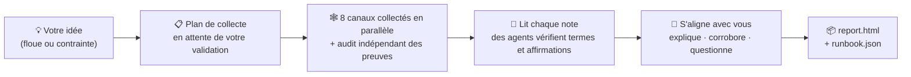

<h1 align="center">🔍 research-anything</h1>

<p align="center"><b>Donnez-lui une idée. Repartez avec un plan.</b></p>

<p align="center">Une skill de recherche tous canaux pour Claude Code — elle passe 8 canaux au crible à la recherche de pratiques de première main, envoie des sous-agents vérifier ce qu'elle ignore, et fait converger le tout vers <b>un plan actionnable adapté à votre situation</b> — pas une liste d'options à rallonge.</p>

<p align="center">
  <a href="README.md">English</a> •
  <a href="README_CN.md">简体中文</a> •
  <a href="README_JA.md">日本語</a> •
  <a href="README_KO.md">한국어</a> •
  <a href="README_ES.md">Español</a> •
  <a href="README_FR.md">Français</a> •
  <a href="README_DE.md">Deutsch</a> •
  <a href="README_PT.md">Português</a> •
  <a href="README_RU.md">Русский</a>
</p>

<p align="center">
  
  
  
  
  
</p>

<p align="center">
  <a href="#-en-quoi-cest-différent-de-ia-va-chercher-pour-moi">Pourquoi c'est différent</a> •
  <a href="#-comment-se-déroule-une-session-de-recherche">Fonctionnement</a> •
  <a href="#-démarrage-rapide">Démarrage rapide</a> •
  <a href="#-configuration-initiale-une-seule-fois">Configuration initiale</a> •
  <a href="#-utilisation">Utilisation</a> •
  <a href="#-ce-que-chaque-canal-rapporte">Canaux</a> •
  <a href="#-faq">FAQ</a>
</p>

---

> **L'état de l'art ne devrait pas rester enfermé dans des fils que vous ne faites jamais défiler.**
> Les pratiques qui fonctionnent vraiment sont éparpillées dans des vidéos Douyin et Xiaohongshu, des tests approfondis sur Bilibili, de longues réponses sur Zhihu, des issues GitHub et des threads X — des endroits hors de portée de la recherche web classique, et où les données d'entraînement des IA sont depuis longtemps périmées. À construire dans son coin, on découvre souvent trop tard que son approche a plusieurs générations de retard.
>
> research-anything coule tout le pipeline — **balayer chaque canal → vérifier les preuves → converger vers un plan** — dans une seule skill Claude Code. Une phrase pour la déclencher, 30 à 60 minutes pour aboutir.

📱 Douyin · 📕 Xiaohongshu (RED) · 💬 Zhihu · 📺 Bilibili · ▶️ YouTube · 🐙 GitHub · 🐦 Twitter(X) · 🌐 Web généraliste

## ✨ En quoi c'est différent de "IA, va chercher pour moi"

| | Le classique « IA, fais-moi des recherches » | research-anything |
|---|---|---|
| **Sources** | Données d'entraînement périmées + quelques recherches web superficielles | Du contenu de première main issu de 8 canaux, y compris les vidéos courtes et les publications communautaires hors de portée de la recherche web |
| **Vidéos et images** | Ne peut pas les regarder ; ne lit que les titres et les accroches | Récupère les sous-titres / transcrit la parole en intégralité, OCRise les images, capture les meilleurs commentaires — tout entre dans les preuves |
| **Termes inconnus** | Devine à partir de la surface | Envoie un sous-agent par terme pour le vérifier (ce que c'est / qui l'a créé / quand il est sorti / ce qu'il remplace), puis assemble une frise générationnelle du domaine |
| **Chiffres et affirmations clés** | Les répète, vraies ou non | Contrôle chacune : les faits face aux sources officielles, les promesses de qualité face au bouche-à-oreille indépendant ; l'autopromotion des éditeurs est étiquetée ; l'invérifiable est marqué « non vérifié » |
| **Quand vos besoins sont flous** | Vous interroge d'emblée sur vos objectifs et votre budget | Explore d'abord le terrain, puis revient avec de vraies informations pour vous aider à cerner ce dont vous avez réellement besoin |
| **Livrable final** | N options en parallèle — c'est encore à vous de choisir | **Un seul** chemin par défaut + conditions de bascule, détaillé jusqu'à l'étape et la commande, chaque conclusion sourcée |

Deux de ces points, développés :

**🧠 Elle sait ce qu'elle ne sait pas — et va combler les lacunes.** L'échec le plus courant de la recherche par IA, ce sont des données d'entraînement figées dans le passé : recommander une approche en retard de plusieurs générations sans s'en rendre compte. Pendant qu'elle relit ses notes, research-anything envoie un sous-agent indépendant pour chaque terme inconnu, nouvel outil ou nouveau modèle (y compris ce qui est plus récent que ses données d'entraînement) afin de le vérifier sur-le-champ, puis ordonne le tout par date de sortie en une frise générationnelle — avant de recommander quoi que ce soit, elle vérifie sur quelle génération la chose repose.

**🌫️→🎯 Les besoins peuvent arriver flous et repartir précis.** Les deux formulations fonctionnent :

> 😶‍🌫️ Flou : « Un itinéraire de week-end à Pékin, 3 jours et 2 nuits »
>
> 📋 Contraint : « Un itinéraire de week-end à Pékin, 3 jours et 2 nuits — 3 adultes + un enfant de 2 ans + une personne de 80 ans, en voiture, budget hôtel sous ¥1,000 par chambre et par nuit »

Face à une demande floue, elle ne vous soumettra pas d'emblée à un interrogatoire (vous ne sauriez de toute façon pas encore bien répondre). Elle explore d'abord ce qui existe, puis revient s'aligner avec vous : elle explique chaque terme qui apparaîtra dans le plan, liste les conclusions clés corroborées indépendamment par plusieurs sources, et ne pose que les quelques questions qui changent réellement les arbitrages. **Le processus de recherche lui-même vous aide à cerner ce dont vous avez besoin.**

## 🔄 Comment se déroule une session de recherche



Dès l'instant où vous énoncez votre idée : elle ne confirme d'abord qu'une seule chose — qu'elle n'a pas mal compris la direction de la recherche — sans vous cuisiner sur des objectifs et des budgets auxquels vous ne pouvez pas encore répondre. Elle vous remet ensuite un **plan de collecte** (canaux × mots-clés × profondeur × estimation de temps/coût). Une fois que vous l'avez ajusté et validé, les 8 canaux démarrent en parallèle : un agent collecteur par canal cherche du contenu réel et consigne sur le disque des notes distillées, puis un agent d'audit indépendant complète les preuves élément par élément — transcriptions vidéo, meilleurs commentaires, texte des images, licences open source. Tout ce qui est en dessous du niveau exigé est intercepté par des validateurs et refait, jamais maquillé en douce.

Après la collecte, l'agent principal lit lui-même chaque note et envoie en parallèle un essaim de sous-agents vérifier les termes inconnus et les affirmations porteuses. Avant de proposer quoi que ce soit, il explique d'abord, questionne ensuite : un tour du glossaire, les conclusions corroborées de manière croisée, et quelques questions d'arbitrage clés. Enfin, il écrit deux livrables dans votre projet — un rapport pour les humains et un runbook pour l'IA — chaque conclusion restant traçable jusqu'à la publication d'origine.

## 🚀 Démarrage rapide

**Prérequis** : vous utilisez déjà [Claude Code](https://claude.com/claude-code) (la skill s'appuie sur son orchestration de sous-agents / Workflows) ; macOS (testé).

Collez le bloc ci-dessous en entier dans Claude Code (ou Codex) et laissez-le faire le travail :

```text
Installe et configure research-anything (une skill de recherche pour Claude Code) étape par étape :

1. Cloner la skill elle-même :
   git clone https://github.com/Somezak1/research-anything.git ~/.claude/skills/research-anything

2. Créer le répertoire d'outils ~/tools/ et installer les collecteurs
   (la documentation de la skill part du principe que chaque outil vit sous ~/tools/) :
   - git clone https://github.com/NanmiCoder/MediaCrawler.git ~/tools/MediaCrawler
     puis installer ses dépendances avec uv en suivant son README
     (sert à collecter Douyin / Xiaohongshu / Zhihu / Bilibili)
   - Installer yt-dlp : brew install yt-dlp (pour récupérer les sous-titres YouTube/Bilibili)

3. S'assurer que le MCP GitHub (plugin github officiel / serveur MCP) est configuré
   dans Claude Code ; le mettre en place sinon
   (le canal GitHub s'en sert pour chercher des dépôts et lire les README et LICENSE)

4. (Optionnel — uniquement pour activer le canal Twitter) Créer un venv uv dédié sous
   ~/tools/twscrape et y installer twscrape (https://github.com/vladkens/twscrape)

5. (Optionnel — recherche Xiaohongshu rapide) Installer https://github.com/xpzouying/xiaohongshu-mcp
   dans ~/tools/xiaohongshu-mcp et l'enregistrer dans la config MCP de Claude Code
   (on peut s'en passer : Xiaohongshu se rabat sur MediaCrawler)

Une fois terminé, rends compte des succès et des échecs point par point, et dis-moi comment corriger manuellement les échecs.
```

> 💡 Le répertoire d'outils doit être `~/tools/` (toutes les commandes de la documentation de la skill sont écrites en fonction de lui). Déjà installé ailleurs ? Un lien symbolique suffit : `ln -s <your tools dir> ~/tools`.

## 🔑 Configuration initiale (une seule fois)

Ces étapes impliquent des connexions par QR code et des identifiants de compte — l'IA ne peut pas le faire à votre place, mais chacune ne se fait qu'une fois :

| Étape | Quoi faire | Si ignorée |
|---|---|---|
| 📲 Connexion aux quatre plateformes (**obligatoire**) | Sous `~/tools/MediaCrawler`, lancer une recherche par plateforme (p. ex. `uv run main.py --platform xhs --type search --keywords "test"`) et scanner le QR code dans le navigateur qui s'ouvre. L'état de connexion persiste ; tourne ensuite sans surveillance | Ces plateformes échouent à collecter |
| 🐦 Twitter (optionnel) | Utiliser un **compte jetable** (jamais votre compte principal), se connecter via le navigateur, récupérer les cookies `auth_token` + `ct0`, puis exécuter `~/tools/twscrape/.venv/bin/twscrape add_cookie <user> 'auth_token=...; ct0=...'` | Le canal Twitter signale son échec ; tout le reste fonctionne |
| 📺 Cookie de sous-titres Bilibili (optionnel) | Exporter vos cookies Bilibili vers `~/tools/bili_cookies.txt` (format Netscape, p. ex. via l'extension Get cookies.txt LOCALLY) | Les vidéos Bilibili se rabattent sur la transcription payante ou signalent un échec |
| 🎙️ Transcription vocale payante (optionnel) | Activer fun-asr sur Alibaba Cloud Bailian (~¥0.8/heure, palier gratuit inclus), puis ajouter `export DASHSCOPE_API_KEY=your_key` à `~/.zshrc` | Les vidéos Douyin/Xiaohongshu ne peuvent pas être transcrites ; texte et commentaires uniquement |

Chaque élément optionnel suit un même principe : **quoi qu'il manque, la capacité correspondante se dégrade honnêtement et c'est signalé dans le rapport — jamais camouflé en silence.**

## 🎬 Utilisation

Ouvrez Claude Code dans n'importe quel projet et dites simplement ce que vous avez en tête — elle se déclenche automatiquement :

> 💬 Je veux créer des dramas en bande dessinée par IA — fais des recherches sur les approches matures du marché

> 💬 Un itinéraire de week-end à Pékin, 3 jours et 2 nuits — 3 adultes + un enfant de 2 ans + une personne de 80 ans, en voiture, budget hôtel sous ¥1,000 par chambre et par nuit

Quand la session se termine, vous trouverez sous `docs/research/<sujet>/` dans votre projet :

| Livrable | Rôle |
|---|---|
| 📄 `report.html` | Pour les humains : synthèse exécutive, frise générationnelle, panorama par canal, plan par défaut + conditions de bascule, matrice comparative, toutes les sources |
| 🤖 `runbook.json` | Pour l'IA : étapes au niveau des commandes, conditions de repli, listes vérifié / non vérifié / à tester |
| 🗂️ `raw/` `verify/` `qa.md` | Chaque note brute, verdict de vérification et transcription des questions-réponses — chaque conclusion remonte à sa source |

## 🕸️ Ce que chaque canal rapporte

| Canal | Collecteur | Preuves capturées |
|---|---|---|
| 📱 Douyin | MediaCrawler | Transcriptions vocales intégrales + meilleurs commentaires + métriques d'engagement |
| 📕 Xiaohongshu | MediaCrawler / xiaohongshu-mcp | Texte des publications + OCR des images + transcriptions vidéo + meilleurs commentaires |
| 💬 Zhihu | MediaCrawler | Réponses/articles intégraux (de quelques centaines à plusieurs dizaines de milliers de mots) + meilleurs commentaires |
| 📺 Bilibili | MediaCrawler + yt-dlp | Texte intégral des sous-titres IA (gratuit) / transcription + meilleurs commentaires + intensité des danmaku |
| ▶️ YouTube | yt-dlp | Texte intégral des sous-titres, récupéré directement (gratuit) + commentaires |
| 🐙 GitHub | GitHub MCP | README réellement lu + étoiles/activité + **vraie vérification du LICENSE à la racine** + exploration des issues |
| 🐦 Twitter(X) | twscrape | Tweets + threads + texte des réponses + sous-titres/transcription des vidéos |
| 🌐 Web généraliste | WebSearch / tavily | Docs officielles, pages de tarifs, comparatifs de fond (pour validation croisée) |

## ❓ FAQ

**Est-ce que ça coûte de l'argent ?** La seule étape susceptible de coûter quelque chose est la transcription vocale payante optionnelle (~¥0.8/heure), et elle ne s'exécute jamais sans que vous ayez explicitement approuvé un plafond chiffré. Tout le reste est gratuit (ça tourne sur l'abonnement Claude Code que vous avez déjà).

**Et si un canal est injoignable ou non configuré ?** Dégradation honnête : ce canal signale la raison de son échec, les autres continuent, et l'annexe du rapport détaille le nombre de résultats et d'échecs par canal et par mot-clé — la couverture n'est jamais truquée en silence.

**Windows / Linux ?** Seul macOS est testé pour l'instant (l'OCR des images utilise une capacité système de macOS). Les autres plateformes nécessitent un script OCR de remplacement — les PR sont les bienvenues.

**Est-ce conforme ?** Le contenu collecté est destiné à la recherche personnelle uniquement ; respectez les conditions d'utilisation de chaque plateforme. La skill intègre une limitation de débit et des garde-fous anti-risque ; utilisez un compte jetable pour Twitter. Tout état de connexion, cookie et clé d'API reste sur votre machine — **ce dépôt ne contient aucun identifiant**.

## 🙏 Sur les épaules de géants

| Projet | Rôle ici |
|---|---|
| [NanmiCoder/MediaCrawler](https://github.com/NanmiCoder/MediaCrawler) | Collecte Douyin / Xiaohongshu / Zhihu / Bilibili |
| [vladkens/twscrape](https://github.com/vladkens/twscrape) | Recherche Twitter/X et capture des réponses |
| [yt-dlp/yt-dlp](https://github.com/yt-dlp/yt-dlp) | Récupération des sous-titres YouTube / Bilibili et téléchargement des vidéos |
| [xpzouying/xiaohongshu-mcp](https://github.com/xpzouying/xiaohongshu-mcp) | Recherche Xiaohongshu rapide (optionnel) |
| Alibaba Cloud Bailian fun-asr | Transcription vocale des vidéos (optionnel, paiement à l'usage) |

## 📁 Structure du dépôt

```
research-anything/
├── SKILL.md               # Point d'entrée de la skill : pipeline et règles d'airain
├── references/            # Procédures étape par étape + 8 guides de canaux
│   └── channels/
└── scripts/               # Orchestration de la collecte, validation des logs, ASR/OCR, ressources du rapport (avec tests)
```

---

<p align="center">Si c'est utile, laissez une ⭐ pour que plus de gens le découvrent.</p>
