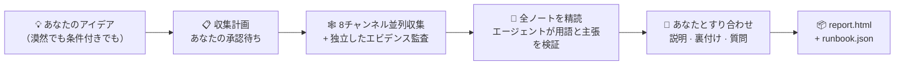

<h1 align="center">🔍 research-anything</h1>

<p align="center"><b>アイデアを渡せば、プランが返ってくる。</b></p>

<p align="center">Claude Code のための全チャンネル・リサーチスキル。8つのチャンネルから一次情報の実践知をかき集め、知らないことはサブエージェントを派遣して検証し、すべてを<b>あなたの状況に合った、実行可能なひとつのプラン</b>に収束させます — 選択肢を並べただけのリストではありません。</p>

<p align="center">
  <a href="README.md"></a>
  <a href="README_CN.md"></a>
  <a href="README_JA.md"></a>
  <a href="README_KO.md"></a>
  <a href="README_ES.md"></a>
  <a href="README_FR.md"></a>
  <a href="README_DE.md"></a>
  <a href="README_PT.md"></a>
  <a href="README_RU.md"></a>
</p>

<p align="center">
  
  
  
  
  
</p>

<p align="center">
  <a href="#-ai調べておいてとはここが違う">何が違うのか</a> •
  <a href="#-リサーチ実行の流れ">仕組み</a> •
  <a href="#-クイックスタート">クイックスタート</a> •
  <a href="#-初回セットアップ1回だけ">初回セットアップ</a> •
  <a href="#-使い方">使い方</a> •
  <a href="#-各チャンネルで得られるもの">チャンネル</a> •
  <a href="#-faq">FAQ</a>
</p>

---

> **最先端の知見が、自分の見ないフィードの中に閉じ込められたままでいいはずがない。**
> 本当に使える実践知は、Douyin（抖音）や Xiaohongshu（小紅書/RED）の動画、Bilibili の徹底レビュー、Zhihu（知乎）の長文回答、GitHub の issue、X のスレッドに散らばっています。通常のウェブ検索では届かず、AI の学習データはとうに古びてしまった場所です。孤立したまま作っていると、自分のやり方が何世代も遅れていたことに、手遅れになってから気づきがちです。
>
> research-anything は、**全チャンネルを走査 → エビデンスを検証 → プランに収束** というパイプライン全体を、ひとつの Claude Code スキルに固めました。一文で起動、30〜60分で完了します。

<p align="center">📱 Douyin（抖音） · 📕 Xiaohongshu（小紅書/RED） · 💬 Zhihu（知乎） · 📺 Bilibili · ▶️ YouTube · 🐙 GitHub · 🐦 Twitter(X) · 🌐 一般ウェブ</p>

## ✨ 「AI、調べておいて」とはここが違う

| | ありがちな「AI にちょっと調べさせる」 | research-anything |
|---|---|---|
| **情報源** | 古びた学習データ + 数回の浅いウェブ検索 | ウェブ検索では届かないショート動画やコミュニティ投稿を含む、8チャンネルからの一次コンテンツ |
| **動画・画像** | 視聴できず、タイトルと紹介文しか読めない | 字幕を取得／音声を全文文字起こしし、画像を OCR、上位コメントも収集 — すべてがエビデンスに入る |
| **未知の用語** | 字面から推測する | 用語ごとにサブエージェントを1体派遣して検証（それは何か／誰が作ったか／いつ出たか／何を置き換えるものか）し、その分野の世代タイムラインを組み立てる |
| **重要な数値・主張** | 真偽を問わずそのまま繰り返す | 一つずつ抜き取り検証：事実は公式ソースと、品質の主張は独立した口コミと突き合わせる。ベンダーの自画自賛にはラベルを付け、検証できないものは「未検証」と明記 |
| **要件が曖昧なとき** | 目標や予算を最初から問い詰めてくる | まず全体像を調査し、実際の情報を携えて戻ってきて、本当に必要なものを見極める手助けをする |
| **最終成果物** | 並列のN案 — 結局選ぶのはあなた | **ひとつ**のデフォルトパス + 切り替え条件。手順・コマンドのレベルまで具体化し、結論はすべて出典付き |

このうち2つを詳しく見てみましょう。

**🧠 自分が知らないことを知っていて、その穴を埋めに行く。** AI リサーチで最もよくある失敗は、過去に凍結された学習データです。何世代も遅れた手法を、それと気づかずに推奨してしまう。research-anything はノートを読み進めながら、見慣れない用語・新しいツール・新しいモデル（学習データより新しいものも含む）が出てくるたびに独立したサブエージェントを派遣してその場で検証し、すべてをリリース日順に並べて世代タイムラインを作ります。何かを推奨する前に、それがどの世代に立っているものかを必ず確認するのです。

**🌫️→🎯 要件は曖昧なまま持ち込み、シャープにして持ち帰る。** どちらの言い方でも動きます：

> 😶‍🌫️ 曖昧：「週末の北京2泊3日プラン」
>
> 📋 条件付き：「週末の北京2泊3日プラン — 大人3人 + 2歳児 + 80歳の高齢者、自家用車で移動、ホテル予算は1泊1室 ¥1,000（元）以下」

曖昧なリクエストに対して、最初から質問攻めにすることはありません（その時点ではどうせうまく答えられないからです）。まず世の中にあるものを調査してから、すり合わせに戻ってきます。プランに登場するすべての用語を説明し、複数ソースが独立に裏付けた主要な結論を列挙し、トレードオフを本当に左右する数個の質問だけを尋ねる。**リサーチの過程そのものが、必要なものを見極める手助けになる**のです。

## 🔄 リサーチ実行の流れ



アイデアを伝えた瞬間から：最初に確認するのはただ一点 — リサーチの方向を読み違えていないか — だけで、まだ答えられない目標や予算を問い詰めることはありません。次に**収集計画**（チャンネル × キーワード × 深さ × 推定時間・コスト）を提示します。あなたが調整して承認すると、8チャンネルが並列で走り出します。チャンネルごとに1体の収集エージェントが実際のコンテンツを検索し、要点を蒸留したノートをディスクに保存。続いて独立した監査エージェントが、動画の文字起こし、上位コメント、画像内テキスト、オープンソースのライセンスといったエビデンスを一件ずつ補完します。基準に満たないものはバリデーターに捕捉されてやり直しになり、こっそりごまかされることは決してありません。

収集が終わると、メインエージェントがすべてのノートを自ら読み込み、見慣れない用語や結論を支える重要な主張を検証するため、サブエージェントの群れを並列で派遣します。何かを提案する前に、まず説明し、それから質問する：用語集のウォークスルー、複数ソースが相互に裏付けた結論、そしてトレードオフを左右する数個の重要な質問です。最後に、2つの成果物 — 人間向けのレポートと AI 向けのランブック — をあなたのプロジェクトに書き出します。すべての結論は、出典の投稿までさかのぼれます。

## 🚀 クイックスタート

**前提条件**：すでに [Claude Code](https://claude.com/claude-code) を使っていること（このスキルはそのサブエージェント / Workflow オーケストレーションに依存します）。macOS（動作確認済み）。

以下のブロックを丸ごと Claude Code（または Codex）に貼り付けて、面倒な作業は任せてしまいましょう：

```text
research-anything（Claude Code のリサーチスキル）を、以下の手順どおりにインストール・設定してください：

1. スキル本体をクローンする：
   git clone https://github.com/Somezak1/research-anything.git ~/.claude/skills/research-anything

2. ツールディレクトリ ~/tools/ を作成し、コレクター群をインストールする
   （スキルのドキュメントは、すべてのツールが ~/tools/ 配下にある前提で書かれています）：
   - git clone https://github.com/NanmiCoder/MediaCrawler.git ~/tools/MediaCrawler
     を実行し、その README に従って uv で依存関係をインストールする
     （Douyin / Xiaohongshu / Zhihu / Bilibili の収集に使用）
   - yt-dlp をインストールする：brew install yt-dlp（YouTube/Bilibili の字幕取得用）

3. Claude Code に GitHub MCP（公式 github プラグイン / MCP サーバー）が設定済みか確認し、
   なければ設定する
   （GitHub チャンネルは、リポジトリ検索や README・LICENSE の読み取りにこれを使います）

4. （任意 — Twitter チャンネルを使いたい場合のみ）~/tools/twscrape 配下に専用の
   uv venv を作成し、twscrape（https://github.com/vladkens/twscrape）をインストールする

5. （任意 — Xiaohongshu の高速検索）https://github.com/xpzouying/xiaohongshu-mcp を
   ~/tools/xiaohongshu-mcp にインストールし、Claude Code の MCP 設定に登録する
   （スキップしても問題ありません：Xiaohongshu は MediaCrawler にフォールバックします）

完了したら、項目ごとに成功／失敗を報告し、失敗した項目を手動で直す方法を教えてください。
```

> 💡 ツールディレクトリは必ず `~/tools/` にしてください（スキルのドキュメント内のコマンドはすべてこのパス前提で書かれています）。すでに別の場所にインストール済み？ シンボリックリンクを張るだけで大丈夫です：`ln -s <your tools dir> ~/tools`。

## 🔑 初回セットアップ（1回だけ）

以下の手順には QR コードログインやアカウントの認証情報が絡むため、AI が代行することはできません。ただし、どれも1回きりです：

| 手順 | やること | スキップした場合 |
|---|---|---|
| 📲 4プラットフォームのログイン（**必須**） | `~/tools/MediaCrawler` 配下で、プラットフォームごとに1回検索を実行し（例：`uv run main.py --platform xhs --type search --keywords "test"`）、開いたブラウザで QR コードをスキャンする。ログイン状態は保持され、以降は無人で動作 | 該当プラットフォームの収集が失敗する |
| 🐦 Twitter（任意） | **捨てアカウント**を使い（メインアカウントは厳禁）、ブラウザでログインして `auth_token` + `ct0` の Cookie を取得し、`~/tools/twscrape/.venv/bin/twscrape add_cookie <user> 'auth_token=...; ct0=...'` を実行する | Twitter チャンネルは失敗を報告するが、他はすべて動作 |
| 📺 Bilibili 字幕用 Cookie（任意） | Bilibili の Cookie を `~/tools/bili_cookies.txt` にエクスポートする（Netscape 形式。例：Get cookies.txt LOCALLY 拡張機能を使用） | Bilibili の動画は有料文字起こしにフォールバックするか、失敗を報告 |
| 🎙️ 有料の音声文字起こし（任意） | Alibaba Cloud Bailian で fun-asr を有効化し（約 ¥0.8（元）/時間、無料枠あり）、`export DASHSCOPE_API_KEY=your_key` を `~/.zshrc` に追記する | Douyin/Xiaohongshu の動画は文字起こし不可。テキストとコメントのみ |

任意項目はすべて同じ原則に従います：**欠けているものがあれば、対応する機能は正直に劣化し、その旨がレポートで開示されます — こっそり取り繕われることは決してありません。**

## 🎬 使い方

任意のプロジェクトで Claude Code を開き、考えていることをそのまま話すだけ — 自動的に起動します：

> 💬 AI コミックドラマを作りたい — 市場にある成熟したアプローチを調べて

> 💬 週末の北京2泊3日プラン — 大人3人 + 2歳児 + 80歳の高齢者、自家用車で移動、ホテル予算は1泊1室 ¥1,000（元）以下

実行が終わると、プロジェクトの `docs/research/<トピック>/` 配下に次のものができています：

| 成果物 | 用途 |
|---|---|
| 📄 `report.html` | 人間向け：エグゼクティブサマリー、世代タイムライン、チャンネル別の全体像、デフォルトプラン + 切り替え条件、比較マトリクス、全ソース一覧 |
| 🤖 `runbook.json` | AI 向け：コマンドレベルの手順、フォールバック条件、検証済み／未検証／要テストの各リスト |
| 🗂️ `raw/` `verify/` `qa.md` | すべての生ノート、検証結果、Q&A の記録 — どの結論も出典までさかのぼれる |

## 🕸️ 各チャンネルで得られるもの

| チャンネル | コレクター | 収集されるエビデンス |
|---|---|---|
| 📱 Douyin | MediaCrawler | 音声の全文文字起こし + 上位コメント + エンゲージメント指標 |
| 📕 Xiaohongshu | MediaCrawler / xiaohongshu-mcp | 投稿テキスト + 画像 OCR + 動画の文字起こし + 上位コメント |
| 💬 Zhihu | MediaCrawler | 回答・記事の全文（数百〜数万字） + 上位コメント |
| 📺 Bilibili | MediaCrawler + yt-dlp | AI 字幕の全文（無料）／文字起こし + 上位コメント + 弾幕（コメント弾幕）の盛り上がり |
| ▶️ YouTube | yt-dlp | 字幕全文を直接取得（無料） + コメント |
| 🐙 GitHub | GitHub MCP | README の実読 + スター数・活動状況 + **ルート直下の LICENSE の実チェック** + issue の掘り起こし |
| 🐦 Twitter(X) | twscrape | ツイート + スレッド + リプライ本文 + 動画の字幕／文字起こし |
| 🌐 一般ウェブ | WebSearch / tavily | 公式ドキュメント、料金ページ、長文の比較記事（クロスバリデーション用） |

## ❓ FAQ

**お金はかかりますか？** 費用が発生しうるのは、任意の有料音声文字起こし（約 ¥0.8（元）/時間）だけです。しかも、金額の上限をあなたが明示的に承認しない限り実行されません。それ以外はすべて無料です（すでに契約している Claude Code のサブスクリプション上で動きます）。

**チャンネルが到達不能・未設定だったら？** 正直に劣化します：そのチャンネルは失敗理由を報告し、残りは動き続けます。レポートの付録にはチャンネル別・キーワード別のヒット数／失敗数が開示され、カバレッジがこっそり偽装されることはありません。

**Windows / Linux は？** 現時点で動作確認済みなのは macOS のみです（画像 OCR に macOS のシステム機能を使用しているため）。他のプラットフォームでは OCR スクリプトの置き換えが必要です — PR 歓迎。

**規約・コンプライアンス面は大丈夫？** 収集したコンテンツは個人のリサーチ目的に限定し、各プラットフォームの利用規約を尊重してください。スキルにはレート制限とリスク回避の制約が組み込まれています。Twitter には捨てアカウントを使ってください。ログイン状態、Cookie、API キーはすべてあなたのマシンから出ません — **このリポジトリに認証情報は一切含まれていません**。

## 🙏 巨人の肩の上に

| プロジェクト | ここでの役割 |
|---|---|
| [NanmiCoder/MediaCrawler](https://github.com/NanmiCoder/MediaCrawler) | Douyin / Xiaohongshu / Zhihu / Bilibili の収集 |
| [vladkens/twscrape](https://github.com/vladkens/twscrape) | Twitter/X の検索とリプライ収集 |
| [yt-dlp/yt-dlp](https://github.com/yt-dlp/yt-dlp) | YouTube / Bilibili の字幕取得と動画ダウンロード |
| [xpzouying/xiaohongshu-mcp](https://github.com/xpzouying/xiaohongshu-mcp) | Xiaohongshu の高速検索（任意） |
| Alibaba Cloud Bailian fun-asr | 動画音声の文字起こし（任意、従量課金） |

## 📁 リポジトリ構成

```
research-anything/
├── SKILL.md               # スキルのエントリポイント：パイプラインと鉄の掟
├── references/            # ステージ別の手順書 + 8チャンネル分のプレイブック
│   └── channels/
└── scripts/               # 収集オーケストレーション、ログ検証、ASR/OCR、レポート用アセット（テスト付き）
```

---

<p align="center">役に立ったら ⭐ を — より多くの人に届きますように。</p>
