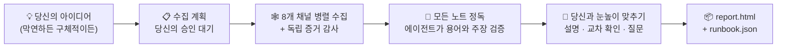

<h1 align="center">🔍 research-anything</h1>

<p align="center"><b>아이디어를 건네세요. 계획이 돌아옵니다.</b></p>

<p align="center">Claude Code를 위한 전 채널 리서치 스킬 — 8개 채널을 훑어 실사용자의 1차 노하우를 수집하고, 모르는 것은 서브 에이전트를 보내 검증하며, 모든 것을 <b>당신의 상황에 맞는 실행 가능한 계획 하나</b>로 수렴시킵니다. 선택지만 잔뜩 나열하고 끝나지 않습니다.</p>

<p align="center">
  <a href="README.md"></a>
  <a href="README_CN.md"></a>
  <a href="README_JA.md"></a>
  <a href="README_KO.md"></a>
  <a href="README_ES.md"></a>
  <a href="README_FR.md"></a>
  <a href="README_DE.md"></a>
  <a href="README_PT.md"></a>
  <a href="README_RU.md"></a>
</p>

<p align="center">
  
  
  
  
  
</p>

<p align="center">
  <a href="#-ai야-검색해-줘와-무엇이-다른가">무엇이 다른가</a> •
  <a href="#-리서치는-이렇게-진행됩니다">작동 방식</a> •
  <a href="#-빠른-시작">빠른 시작</a> •
  <a href="#-최초-1회-설정">최초 설정</a> •
  <a href="#-사용법">사용법</a> •
  <a href="#-채널별로-얻는-것">채널</a> •
  <a href="#-faq">FAQ</a>
</p>

---

> **최신 기술이, 당신이 스크롤하지 않는 피드 안에 갇혀 있어서는 안 됩니다.**
> 실제로 통하는 노하우는 더우인과 샤오홍슈의 영상, 비리비리의 심층 리뷰, 즈후의 장문 답변, GitHub 이슈, X 스레드에 흩어져 있습니다 — 일반 웹 검색은 닿지 못하고, AI 학습 데이터는 이미 한참 낡아 버린 곳들입니다. 고립된 채 만들다 보면, 자신의 접근법이 몇 세대나 뒤처져 있었다는 사실을 너무 늦게 알게 되기 십상입니다.
>
> research-anything은 **모든 채널 훑기 → 증거 검증 → 계획으로 수렴**이라는 파이프라인 전체를 하나의 Claude Code 스킬로 단단히 굳혔습니다. 한 문장이면 시작되고, 30–60분이면 끝납니다.

<p align="center">📱 더우인 · 📕 샤오홍슈 (RED) · 💬 즈후 · 📺 비리비리 · ▶️ YouTube · 🐙 GitHub · 🐦 Twitter(X) · 🌐 일반 웹</p>

## ✨ "AI야, 검색해 줘"와 무엇이 다른가

| | 흔한 "AI야, 리서치 좀 해 줘" | research-anything |
|---|---|---|
| **소스** | 낡은 학습 데이터 + 얕은 웹 검색 몇 번 | 웹 검색이 닿지 못하는 숏폼 영상과 커뮤니티 게시물까지 포함한 8개 채널의 1차 콘텐츠 |
| **영상과 이미지** | 시청 불가; 제목과 소개 문구만 읽음 | 자막 추출 / 음성 전체 전사, 이미지 OCR, 상위 댓글 수집 — 전부 증거로 편입 |
| **낯선 용어** | 겉만 보고 추측 | 용어마다 서브 에이전트를 하나씩 파견해 검증(무엇인지 / 누가 만들었는지 / 언제 출시됐는지 / 무엇을 대체하는지)한 뒤, 해당 분야의 세대별 타임라인을 구성 |
| **핵심 수치와 주장** | 사실이든 아니든 그대로 반복 | 하나하나 대조 검증: 사실은 공식 소스와, 품질 주장은 독립적인 입소문과 대조; 업체의 자화자찬에는 라벨을 붙이고, 검증할 수 없는 것은 "미검증"으로 표기 |
| **요구사항이 막연할 때** | 목표와 예산부터 꼬치꼬치 캐물음 | 먼저 전체 지형을 살핀 뒤, 실제 정보를 들고 돌아와 당신이 정말 필요한 것이 무엇인지 찾도록 도움 |
| **최종 산출물** | 병렬 선택지 N개 — 결국 고르는 건 당신 몫 | 기본 경로 **하나** + 전환 조건, 단계/명령어 수준까지, 모든 결론에 출처 표기 |

그중 두 가지를 좀 더 자세히:

**🧠 자신이 모른다는 것을 알고, 그 공백을 직접 메우러 갑니다.** AI 리서치의 가장 흔한 실패는 과거에 얼어붙은 학습 데이터입니다. 몇 세대나 뒤처진 접근법을 그런 줄도 모르고 추천하는 것이죠. research-anything은 노트를 읽어 나가는 동안 낯선 용어, 새 도구, 새 모델(학습 데이터보다 최신인 것 포함)마다 독립 서브 에이전트를 파견해 그 자리에서 검증하고, 모든 것을 출시일 순으로 정렬해 세대별 타임라인을 만듭니다 — 무언가를 추천하기 전에, 그것이 어느 세대에 서 있는지부터 확인합니다.

**🌫️→🎯 요구사항은 막연하게 들어와서 뾰족하게 나갈 수 있습니다.** 아래 둘 다 잘 작동합니다:

> 😶‍🌫️ 막연하게: "주말 2박 3일 베이징 여행 일정"
>
> 📋 구체적으로: "주말 2박 3일 베이징 여행 일정 — 성인 3명 + 2세 아이 + 80세 어르신, 자가운전, 호텔 예산은 1박 1실 ¥1,000 이하"

막연한 요청을 받아도 처음부터 캐묻지 않습니다(어차피 아직은 제대로 답하기 어려우니까요). 먼저 바깥에 무엇이 있는지 살핀 다음 돌아와 당신과 눈높이를 맞춥니다: 계획에 등장할 모든 용어를 설명하고, 여러 소스가 독립적으로 교차 확인한 핵심 결론을 정리해 주고, 트레이드오프를 실제로 바꾸는 몇 가지 질문만 던집니다. **리서치 과정 자체가 당신이 무엇을 필요로 하는지 찾도록 돕습니다.**

## 🔄 리서치는 이렇게 진행됩니다



아이디어를 말하는 순간부터: 먼저 딱 한 가지 — 리서치 방향을 잘못 읽지 않았는지 — 만 확인하고, 아직 답할 수 없는 목표나 예산은 캐묻지 않습니다. 그다음 **수집 계획**(채널 × 키워드 × 깊이 × 예상 시간/비용)을 건넵니다. 당신이 다듬어 승인하면 8개 채널이 병렬로 가동됩니다: 채널마다 수집 에이전트 하나가 실제 콘텐츠를 검색해 정제된 노트를 디스크에 기록하고, 독립 감사 에이전트가 증거를 항목별로 완성합니다 — 영상 전사, 상위 댓글, 이미지 속 텍스트, 오픈소스 라이선스까지. 기준에 못 미치는 것은 검증기에 걸려 다시 수행되며, 절대 슬쩍 얼버무리고 넘어가지 않습니다.

수집이 끝나면 메인 에이전트가 모든 노트를 직접 정독하면서, 낯선 용어와 결론을 떠받치는 핵심 주장을 검증할 서브 에이전트 무리를 병렬로 파견합니다. 무언가를 제안하기 전에 설명이 먼저, 질문은 그다음입니다: 용어집 안내, 교차 검증된 결론들, 그리고 몇 가지 핵심 트레이드오프 질문. 마지막으로 당신의 프로젝트 안에 산출물 두 개를 작성합니다 — 사람을 위한 리포트와 AI를 위한 런북. 모든 결론은 원 출처 게시물까지 거슬러 추적할 수 있습니다.

## 🚀 빠른 시작

**사전 요구사항**: 이미 [Claude Code](https://claude.com/claude-code)를 사용 중이어야 합니다(이 스킬은 Claude Code의 서브 에이전트 / Workflow 오케스트레이션에 의존합니다); macOS(테스트 완료).

아래 블록 전체를 Claude Code(또는 Codex)에 붙여넣고 궂은일은 맡겨 두세요:

```text
research-anything(Claude Code 리서치 스킬)을 단계별로 설치하고 설정해 주세요:

1. 스킬 본체 클론:
   git clone https://github.com/Somezak1/research-anything.git ~/.claude/skills/research-anything

2. 도구 디렉터리 ~/tools/ 를 만들고 수집기 설치
   (스킬 문서는 모든 도구가 ~/tools/ 아래에 있다고 가정합니다):
   - git clone https://github.com/NanmiCoder/MediaCrawler.git ~/tools/MediaCrawler
     후, 해당 README에 따라 uv로 의존성 설치
     (더우인 / 샤오홍슈 / 즈후 / 비리비리 수집에 사용)
   - yt-dlp 설치: brew install yt-dlp (YouTube/비리비리 자막 추출용)

3. Claude Code에 GitHub MCP(공식 github 플러그인 / MCP 서버)가 설정되어 있는지
   확인하고, 없으면 설정해 주세요
   (GitHub 채널이 저장소 검색과 README·LICENSE 읽기에 이를 사용합니다)

4. (선택 — Twitter 채널이 필요할 때만) ~/tools/twscrape 아래에 전용 uv venv를 만들고
   twscrape 설치 (https://github.com/vladkens/twscrape)

5. (선택 — 샤오홍슈 빠른 검색) https://github.com/xpzouying/xiaohongshu-mcp 를
   ~/tools/xiaohongshu-mcp 에 설치하고 Claude Code의 MCP 설정에 등록
   (건너뛰어도 무방: 샤오홍슈는 MediaCrawler로 폴백됩니다)

끝나면 항목별로 성공/실패를 보고하고, 실패한 항목을 수동으로 고치는 방법을 알려 주세요.
```

> 💡 도구 디렉터리는 반드시 `~/tools/` 여야 합니다(스킬 문서의 모든 명령어가 이 경로를 기준으로 작성되어 있습니다). 이미 다른 곳에 설치해 두었다면 심볼릭 링크만 걸어 주세요: `ln -s <your tools dir> ~/tools`.

## 🔑 최초 1회 설정

이 단계들은 QR 코드 로그인과 계정 자격 증명이 필요해 AI가 대신해 줄 수 없지만, 각각 한 번만 하면 됩니다:

| 단계 | 할 일 | 건너뛰면 |
|---|---|---|
| 📲 4개 플랫폼 로그인(**필수**) | `~/tools/MediaCrawler` 아래에서 플랫폼별로 검색을 한 번씩 실행하고(예: `uv run main.py --platform xhs --type search --keywords "test"`) 열리는 브라우저에서 QR 코드 스캔. 로그인 상태는 유지되어 이후로는 무인 실행 | 해당 플랫폼 수집 실패 |
| 🐦 Twitter(선택) | **부계정**(절대 본계정 금지)으로 브라우저에서 로그인해 `auth_token` + `ct0` 쿠키를 확보한 뒤 `~/tools/twscrape/.venv/bin/twscrape add_cookie <user> 'auth_token=...; ct0=...'` 실행 | Twitter 채널만 실패로 보고되고 나머지는 정상 동작 |
| 📺 비리비리 자막 쿠키(선택) | 비리비리 쿠키를 `~/tools/bili_cookies.txt` 로 내보내기(Netscape 형식, 예: Get cookies.txt LOCALLY 확장 프로그램 사용) | 비리비리 영상은 유료 전사로 폴백되거나 실패로 보고 |
| 🎙️ 유료 음성 전사(선택) | 알리바바 클라우드 바이롄(Bailian)에서 fun-asr 활성화(약 ¥0.8/시간, 무료 할당량 포함) 후 `~/.zshrc` 에 `export DASHSCOPE_API_KEY=your_key` 추가 | 더우인/샤오홍슈 영상은 전사 불가; 텍스트와 댓글만 수집 |

모든 선택 항목은 한 가지 원칙을 따릅니다: **무엇이 빠져 있든, 해당 기능은 정직하게 축소되고 그 사실이 리포트에 공개됩니다 — 절대 조용히 덮어 가리지 않습니다.**

## 🎬 사용법

아무 프로젝트에서나 Claude Code를 열고 생각나는 대로 말하면 자동으로 발동합니다:

> 💬 AI 만화 드라마를 만들고 싶어 — 시장에 나와 있는 성숙한 접근법을 조사해 줘

> 💬 주말 2박 3일 베이징 여행 일정 — 성인 3명 + 2세 아이 + 80세 어르신, 자가운전, 호텔 예산은 1박 1실 ¥1,000 이하

실행이 끝나면 프로젝트의 `docs/research/<주제>/` 아래에서 다음을 확인할 수 있습니다:

| 산출물 | 용도 |
|---|---|
| 📄 `report.html` | 사람용: 핵심 요약, 세대별 타임라인, 채널별 지형, 기본 계획 + 전환 조건, 비교 매트릭스, 전체 출처 |
| 🤖 `runbook.json` | AI용: 명령어 수준의 단계, 폴백 조건, 검증됨 / 미검증 / 테스트 필요 목록 |
| 🗂️ `raw/` `verify/` `qa.md` | 모든 원시 노트, 검증 판정, Q&A 기록 — 모든 결론은 원 출처 게시물까지 추적 가능 |

## 🕸️ 채널별로 얻는 것

| 채널 | 수집기 | 확보되는 증거 |
|---|---|---|
| 📱 더우인 | MediaCrawler | 음성 전문 전사 + 상위 댓글 + 참여 지표 |
| 📕 샤오홍슈 | MediaCrawler / xiaohongshu-mcp | 게시물 텍스트 + 이미지 OCR + 영상 전사 + 상위 댓글 |
| 💬 즈후 | MediaCrawler | 답변/아티클 전문(수백 자에서 수만 자까지) + 상위 댓글 |
| 📺 비리비리 | MediaCrawler + yt-dlp | AI 자막 전문(무료) / 전사 + 상위 댓글 + 탄막 열기 |
| ▶️ YouTube | yt-dlp | 자막 전문 직접 추출(무료) + 댓글 |
| 🐙 GitHub | GitHub MCP | README 실제 정독 + 스타/활동 지표 + **루트 LICENSE 실제 확인** + 이슈 마이닝 |
| 🐦 Twitter(X) | twscrape | 트윗 + 스레드 + 답글 텍스트 + 영상 자막/전사 |
| 🌐 일반 웹 | WebSearch / tavily | 공식 문서, 가격 페이지, 장문 비교 글(교차 검증용) |

## ❓ FAQ

**돈이 드나요?** 비용이 발생할 수 있는 유일한 단계는 선택 사항인 유료 음성 전사(약 ¥0.8/시간)이며, 숫자로 명시된 상한을 당신이 직접 승인하지 않는 한 절대 실행되지 않습니다. 나머지는 전부 무료입니다(이미 쓰고 있는 Claude Code 구독 위에서 돌아갑니다).

**채널이 막혀 있거나 설정이 안 돼 있으면?** 정직한 축소: 해당 채널은 실패 사유를 보고하고 나머지는 계속 실행되며, 리포트 부록에 채널별·키워드별 성공/실패 건수가 공개됩니다 — 커버리지를 조용히 부풀리는 일은 없습니다.

**Windows / Linux는요?** 지금까지는 macOS에서만 테스트되었습니다(이미지 OCR이 macOS 시스템 기능을 사용합니다). 다른 플랫폼은 대체 OCR 스크립트가 필요합니다 — PR 환영합니다.

**규정에는 문제없나요?** 수집된 콘텐츠는 개인 연구 용도로만 사용하고, 각 플랫폼의 이용약관을 준수하세요. 스킬에는 속도 제한과 리스크 방지 제약이 내장되어 있으며, Twitter는 부계정을 사용하세요. 모든 로그인 상태, 쿠키, API 키는 당신의 기기에만 남습니다 — **이 저장소에는 어떤 자격 증명도 들어 있지 않습니다**.

## 🙏 이 프로젝트들의 어깨 위에서

| 프로젝트 | 여기서의 역할 |
|---|---|
| [NanmiCoder/MediaCrawler](https://github.com/NanmiCoder/MediaCrawler) | 더우인 / 샤오홍슈 / 즈후 / 비리비리 수집 |
| [vladkens/twscrape](https://github.com/vladkens/twscrape) | Twitter/X 검색과 답글 수집 |
| [yt-dlp/yt-dlp](https://github.com/yt-dlp/yt-dlp) | YouTube / 비리비리 자막 추출과 영상 다운로드 |
| [xpzouying/xiaohongshu-mcp](https://github.com/xpzouying/xiaohongshu-mcp) | 샤오홍슈 빠른 검색(선택) |
| 알리바바 클라우드 바이롄(Bailian) fun-asr | 영상 음성 전사(선택, 종량 과금) |

## 📁 저장소 구조

```
research-anything/
├── SKILL.md               # 스킬 진입점: 파이프라인과 철칙
├── references/            # 단계별 절차 + 8개 채널 플레이북
│   └── channels/
└── scripts/               # 수집 오케스트레이션, 로그 검증, ASR/OCR, 리포트 에셋(테스트 포함)
```

---

<p align="center">유용했다면 ⭐ 하나 남겨 더 많은 사람이 찾을 수 있게 해 주세요.</p>
