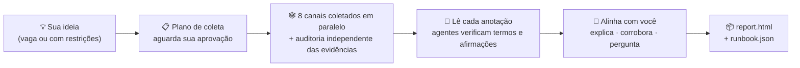

<h1 align="center">🔍 research-anything</h1>

<p align="center"><b>Você entrega uma ideia. Ele devolve um plano.</b></p>

<p align="center">Uma skill de pesquisa omnicanal para o Claude Code — ela varre 8 canais em busca de práticas de primeira mão, despacha subagentes para verificar o que não sabe e converge tudo em <b>um único plano acionável que se encaixa na sua situação</b> — não uma lista interminável de opções.</p>

<p align="center">
  <a href="README.md"></a>
  <a href="README_CN.md"></a>
  <a href="README_JA.md"></a>
  <a href="README_KO.md"></a>
  <a href="README_ES.md"></a>
  <a href="README_FR.md"></a>
  <a href="README_DE.md"></a>
  <a href="README_PT.md"></a>
  <a href="README_RU.md"></a>
</p>

<p align="center">
  
  
  
  
  
</p>

<p align="center">
  <a href="#-por-que-é-diferente-de-ia-vai-pesquisar-pra-mim">Por que é diferente</a> •
  <a href="#-como-uma-rodada-de-pesquisa-se-desenrola">Como funciona</a> •
  <a href="#-início-rápido">Início rápido</a> •
  <a href="#-configuração-inicial-uma-única-vez">Configuração inicial</a> •
  <a href="#-como-usar">Como usar</a> •
  <a href="#-o-que-cada-canal-entrega">Canais</a> •
  <a href="#-faq">FAQ</a>
</p>

---

> **O estado da arte não deveria ficar trancado em feeds que você nunca rola.**
> As práticas que realmente funcionam estão espalhadas por vídeos do Douyin e do Xiaohongshu, análises aprofundadas do Bilibili, respostas longas do Zhihu, issues do GitHub e threads do X — lugares que a busca comum na web não alcança e onde os dados de treinamento das IAs já envelheceram faz tempo. Quem constrói isolado costuma descobrir tarde demais que sua abordagem está gerações atrás.
>
> O research-anything consolida todo o pipeline — **varrer todos os canais → verificar as evidências → convergir em um plano** — em uma única skill do Claude Code. Uma frase para disparar, 30–60 minutos para concluir.

<p align="center">📱 Douyin · 📕 Xiaohongshu (RED) · 💬 Zhihu · 📺 Bilibili · ▶️ YouTube · 🐙 GitHub · 🐦 Twitter(X) · 🌐 Web em geral</p>

## ✨ Por que é diferente de "IA, vai pesquisar pra mim"

| | O clássico "IA, faz uma pesquisa aí" | research-anything |
|---|---|---|
| **Fontes** | Dados de treinamento defasados + algumas buscas superficiais na web | Conteúdo de primeira mão de 8 canais, incluindo vídeos curtos e posts de comunidades que a busca na web não alcança |
| **Vídeos e imagens** | Não consegue assisti-los; lê só títulos e descrições | Extrai legendas / transcreve toda a fala, aplica OCR nas imagens, captura os principais comentários — tudo entra nas evidências |
| **Termos desconhecidos** | Chuta pela superfície | Despacha um subagente por termo para verificá-lo (o que é / quem fez / quando foi lançado / o que ele substitui) e depois monta uma linha do tempo geracional da área |
| **Números e afirmações-chave** | Repete-os, sendo verdadeiros ou não | Confere cada um por amostragem: fatos contra fontes oficiais, alegações de qualidade contra o boca a boca independente; autoelogio de fornecedor recebe rótulo; o que não dá para verificar é marcado como "não verificado" |
| **Quando suas necessidades são vagas** | Interroga você sobre metas e orçamento logo de cara | Primeiro mapeia o cenário e depois volta com informações reais para ajudar você a descobrir o que realmente precisa |
| **Entrega final** | N opções paralelas — você ainda tem que escolher | **Um** caminho padrão + condições de troca, detalhado até o nível de passo/comando, com toda conclusão citada |

Dois desses pontos, em detalhe:

**🧠 Ele sabe o que não sabe — e vai atrás para preencher as lacunas.** A falha mais comum da pesquisa feita por IA são dados de treinamento congelados no passado: recomendar uma abordagem gerações atrás sem perceber. Enquanto lê suas anotações, o research-anything despacha um subagente independente para cada termo desconhecido, ferramenta nova ou modelo novo (inclusive coisas mais recentes que seus dados de treinamento) para verificá-lo na hora, e então ordena tudo por data de lançamento em uma linha do tempo geracional — antes de recomendar qualquer coisa, ele confere em qual geração aquilo está.

**🌫️→🎯 Os requisitos podem entrar vagos e sair afiados.** Estes dois funcionam:

> 😶‍🌫️ Vago: "Um roteiro de fim de semana em Pequim, 3 dias e 2 noites"
>
> 📋 Com restrições: "Um roteiro de fim de semana em Pequim, 3 dias e 2 noites — 3 adultos + uma criança de 2 anos + um idoso de 80 anos, de carro próprio, orçamento de hotel abaixo de ¥1,000 por quarto por noite"

Diante de um pedido vago, a skill não vai interrogar você logo de cara (você ainda nem conseguiria responder bem). Ela primeiro mapeia o que existe e depois volta para se alinhar com você: explica cada termo que vai aparecer no plano, lista as conclusões-chave corroboradas de forma independente por múltiplas fontes e faz apenas as poucas perguntas que realmente mudam os trade-offs. **O próprio processo de pesquisa ajuda você a descobrir o que precisa.**

## 🔄 Como uma rodada de pesquisa se desenrola



A partir do momento em que você expõe sua ideia: primeiro ele confirma uma única coisa — que não entendeu errado a direção da pesquisa — sem bombardear você com perguntas sobre metas e orçamentos que você ainda não sabe responder. Em seguida, entrega um **plano de coleta** (canais × palavras-chave × profundidade × estimativa de tempo/custo). Depois que você ajusta e aprova, os 8 canais partem em paralelo: um agente coletor por canal busca conteúdo real e registra anotações destiladas em disco; depois, um agente de auditoria independente completa as evidências item por item — transcrições de vídeo, principais comentários, texto das imagens, licenças de código aberto. O que ficar abaixo da régua é pego pelos validadores e refeito — nunca maquiado em silêncio.

Terminada a coleta, o agente principal lê pessoalmente cada anotação, despachando um enxame de subagentes em paralelo para verificar termos desconhecidos e afirmações estruturais. Antes de propor qualquer coisa, ele primeiro explica e só depois pergunta: um passeio pelo glossário, as conclusões corroboradas por múltiplas fontes e algumas perguntas-chave sobre trade-offs. Por fim, escreve duas entregas no seu projeto — um relatório para humanos e um runbook para a IA — com cada conclusão rastreável até o post de origem.

## 🚀 Início rápido

**Pré-requisitos**: você já usa o [Claude Code](https://claude.com/claude-code) (a skill depende da orquestração de subagentes / Workflow dele); macOS (testado).

Cole o bloco inteiro abaixo no Claude Code (ou no Codex) e deixe que ele faça o trabalho pesado:

```text
Por favor, instale e configure o research-anything (uma skill de pesquisa do Claude Code) passo a passo:

1. Clone a skill em si:
   git clone https://github.com/Somezak1/research-anything.git ~/.claude/skills/research-anything

2. Crie o diretório de ferramentas ~/tools/ e instale os coletores
   (a documentação da skill assume que toda ferramenta fica em ~/tools/):
   - git clone https://github.com/NanmiCoder/MediaCrawler.git ~/tools/MediaCrawler
     e instale as dependências dele com uv conforme o README do projeto
     (usado para coletar Douyin / Xiaohongshu / Zhihu / Bilibili)
   - Instale o yt-dlp: brew install yt-dlp (para obter legendas do YouTube/Bilibili)

3. Garanta que o Claude Code tenha o GitHub MCP (plugin github oficial / servidor MCP)
   configurado; configure-o se não tiver
   (o canal do GitHub depende dele para buscar repositórios e ler READMEs e LICENSEs)

4. (Opcional — apenas se você quiser o canal do Twitter) Crie um venv uv dedicado em
   ~/tools/twscrape e instale o twscrape (https://github.com/vladkens/twscrape)

5. (Opcional — busca rápida no Xiaohongshu) Instale https://github.com/xpzouying/xiaohongshu-mcp
   em ~/tools/xiaohongshu-mcp e registre-o na configuração de MCP do Claude Code
   (pular não tem problema: o Xiaohongshu recorre ao MediaCrawler)

Ao terminar, relate sucesso/falha item por item e me diga como corrigir as falhas manualmente.
```

> 💡 O diretório de ferramentas precisa ser `~/tools/` (todos os comandos na documentação da skill foram escritos com base nele). Já instalou em outro lugar? Basta criar um symlink: `ln -s <your tools dir> ~/tools`.

## 🔑 Configuração inicial (uma única vez)

Estes passos envolvem logins por QR code e credenciais de conta — a IA não pode fazê-los no seu lugar, mas cada um é feito uma única vez:

| Passo | O que fazer | Se pular |
|---|---|---|
| 📲 Login nas quatro plataformas (**obrigatório**) | Em `~/tools/MediaCrawler`, execute uma busca por plataforma (p. ex. `uv run main.py --platform xhs --type search --keywords "test"`) e escaneie o QR code no navegador que ele abrir. O estado de login persiste; depois disso, roda sem supervisão | Essas plataformas falham na coleta |
| 🐦 Twitter (opcional) | Use uma **conta descartável** (nunca a sua principal), faça login pelo navegador, capture os cookies `auth_token` + `ct0` e então execute `~/tools/twscrape/.venv/bin/twscrape add_cookie <user> 'auth_token=...; ct0=...'` | O canal do Twitter reporta falha; todo o resto funciona |
| 📺 Cookie de legendas do Bilibili (opcional) | Exporte seus cookies do Bilibili para `~/tools/bili_cookies.txt` (formato Netscape, p. ex. via a extensão Get cookies.txt LOCALLY) | Os vídeos do Bilibili recorrem à transcrição paga ou reportam falha |
| 🎙️ Transcrição de fala paga (opcional) | Ative o fun-asr no Alibaba Cloud Bailian (~¥0.8/hora, com camada gratuita inclusa) e adicione `export DASHSCOPE_API_KEY=your_key` ao `~/.zshrc` | Vídeos do Douyin/Xiaohongshu não podem ser transcritos; apenas texto e comentários |

Todo item opcional segue um único princípio: **o que quer que falte, a capacidade correspondente degrada honestamente e isso é declarado no relatório — nunca encoberto em silêncio.**

## 🎬 Como usar

Abra o Claude Code em qualquer projeto e simplesmente diga o que está pensando — a skill dispara automaticamente:

> 💬 Quero fazer dramas de quadrinhos com IA — pesquise as abordagens maduras que existem no mercado

> 💬 Um roteiro de fim de semana em Pequim, 3 dias e 2 noites — 3 adultos + uma criança de 2 anos + um idoso de 80 anos, de carro próprio, orçamento de hotel abaixo de ¥1,000 por quarto por noite

Quando a execução termina, você encontra em `docs/research/<tema>/` no seu projeto:

| Entrega | Finalidade |
|---|---|
| 📄 `report.html` | Para humanos: resumo executivo, linha do tempo geracional, panorama por canal, plano padrão + condições de troca, matriz de comparação, todas as fontes |
| 🤖 `runbook.json` | Para a IA: passos no nível de comando, condições de fallback, listas de verificado / não verificado / a testar |
| 🗂️ `raw/` `verify/` `qa.md` | Cada anotação bruta, veredito de verificação e transcrição de perguntas e respostas — toda conclusão rastreia de volta à sua fonte |

## 🕸️ O que cada canal entrega

| Canal | Coletor | Evidências capturadas |
|---|---|---|
| 📱 Douyin | MediaCrawler | Transcrições completas da fala + principais comentários + métricas de engajamento |
| 📕 Xiaohongshu | MediaCrawler / xiaohongshu-mcp | Texto dos posts + OCR de imagens + transcrições de vídeo + principais comentários |
| 💬 Zhihu | MediaCrawler | Respostas/artigos completos (de centenas a dezenas de milhares de palavras) + principais comentários |
| 📺 Bilibili | MediaCrawler + yt-dlp | Texto completo das legendas de IA (grátis) / transcrição + principais comentários + calor dos danmaku |
| ▶️ YouTube | yt-dlp | Texto completo das legendas, obtido diretamente (grátis) + comentários |
| 🐙 GitHub | GitHub MCP | README lido de verdade + estrelas/atividade + **checagem real da LICENSE na raiz** + mineração de issues |
| 🐦 Twitter(X) | twscrape | Tweets + threads + texto das respostas + legendas/transcrição de vídeos |
| 🌐 Web em geral | WebSearch / tavily | Documentação oficial, páginas de preços, comparativos longos (para validação cruzada) |

## ❓ FAQ

**Custa dinheiro?** O único passo que pode custar algo é a transcrição de fala paga opcional (~¥0.8/hora), e ela nunca roda sem a sua aprovação explícita de um teto numérico. Todo o resto é grátis (roda na assinatura do Claude Code que você já tem).

**E se um canal estiver inacessível ou não configurado?** Degradação honesta: esse canal reporta o motivo da falha, os demais continuam rodando, e o apêndice do relatório declara as contagens de acertos/falhas por canal e por palavra-chave — a cobertura nunca é forjada em silêncio.

**Windows / Linux?** Por enquanto, só o macOS foi testado (o OCR de imagens usa um recurso do sistema do macOS). Outras plataformas precisam de um script de OCR substituto — PRs são bem-vindos.

**Está em conformidade?** O conteúdo coletado é apenas para pesquisa pessoal; respeite os termos de serviço de cada plataforma. A skill tem limitação de taxa e restrições anti-risco embutidas; use uma conta descartável para o Twitter. Todo o estado de login, cookies e chaves de API ficam na sua máquina — **este repositório não contém nenhuma credencial**.

## 🙏 Sobre os ombros de gigantes

| Projeto | Papel aqui |
|---|---|
| [NanmiCoder/MediaCrawler](https://github.com/NanmiCoder/MediaCrawler) | Coleta de Douyin / Xiaohongshu / Zhihu / Bilibili |
| [vladkens/twscrape](https://github.com/vladkens/twscrape) | Busca no Twitter/X e captura de respostas |
| [yt-dlp/yt-dlp](https://github.com/yt-dlp/yt-dlp) | Obtenção de legendas e download de vídeos do YouTube / Bilibili |
| [xpzouying/xiaohongshu-mcp](https://github.com/xpzouying/xiaohongshu-mcp) | Busca rápida no Xiaohongshu (opcional) |
| Alibaba Cloud Bailian fun-asr | Transcrição de fala de vídeos (opcional, pagamento por uso) |

## 📁 Estrutura do repositório

```
research-anything/
├── SKILL.md               # Entrada da skill: pipeline e regras de ferro
├── references/            # Procedimentos etapa por etapa + 8 playbooks de canais
│   └── channels/
└── scripts/               # Orquestração da coleta, validação de logs, ASR/OCR, assets do relatório (com testes)
```

---

<p align="center">Se isto for útil, deixe uma ⭐ para que mais pessoas possam encontrá-lo.</p>
