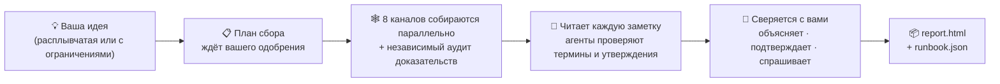

<h1 align="center">🔍 research-anything</h1>

<p align="center"><b>Дайте идею — получите план.</b></p>

<p align="center">Всеканальный исследовательский навык для Claude Code: он прочёсывает 8 каналов в поисках практик из первых рук, отправляет суб-агентов проверять то, чего не знает, и сводит всё в <b>один рабочий план под вашу ситуацию</b> — а не в длинный список вариантов на выбор.</p>

<p align="center">
  <a href="README.md"></a>
  <a href="README_CN.md"></a>
  <a href="README_JA.md"></a>
  <a href="README_KO.md"></a>
  <a href="README_ES.md"></a>
  <a href="README_FR.md"></a>
  <a href="README_DE.md"></a>
  <a href="README_PT.md"></a>
  <a href="README_RU.md"></a>
</p>

<p align="center">
  <a href="#-чем-это-отличается-от-ии-поищи-за-меня">Чем это отличается</a> •
  <a href="#-как-проходит-исследование">Как это работает</a> •
  <a href="#-быстрый-старт">Быстрый старт</a> •
  <a href="#-первоначальная-настройка-один-раз">Первоначальная настройка</a> •
  <a href="#-использование">Использование</a> •
  <a href="#-что-даёт-каждый-канал">Каналы</a> •
  <a href="#-faq">FAQ</a>
</p>

---

> **Передовой опыт не должен оставаться запертым в лентах, которые вы никогда не листаете.**
> Практики, которые действительно работают, разбросаны по видео на Douyin и Xiaohongshu, обстоятельным обзорам на Bilibili, длинным ответам на Zhihu, ишью на GitHub и тредам в X — там, куда обычный веб-поиск не дотягивается и где обучающие данные ИИ давно устарели. Работая в изоляции, вы нередко слишком поздно обнаруживаете, что ваш подход отстал на несколько поколений.
>
> research-anything упаковывает весь конвейер — **прочесать все каналы → проверить доказательства → сойтись на плане** — в один навык Claude Code. Одна фраза для запуска, 30–60 минут до результата.

<p align="center">📱 Douyin · 📕 Xiaohongshu (RED) · 💬 Zhihu · 📺 Bilibili · ▶️ YouTube · 🐙 GitHub · 🐦 Twitter(X) · 🌐 Общий веб</p>

## ✨ Чем это отличается от «ИИ, поищи за меня»

| | Привычное «ИИ, поизучай тему» | research-anything |
|---|---|---|
| **Источники** | Устаревшие обучающие данные + пара поверхностных веб-поисков | Контент из первых рук с 8 каналов, включая короткие видео и посты сообществ, до которых веб-поиск не добирается |
| **Видео и картинки** | Смотреть не умеет — читает только заголовки и аннотации | Вытягивает субтитры / транскрибирует речь целиком, распознаёт текст на картинках, собирает топовые комментарии — всё попадает в доказательную базу |
| **Незнакомые термины** | Гадает по внешним признакам | Отправляет по суб-агенту на каждый термин, чтобы проверить его (что это / кто сделал / когда вышло / что заменяет), а затем собирает поколенческую хронологию области |
| **Ключевые цифры и утверждения** | Повторяет их — правдивы они или нет | Выборочно проверяет каждое: факты — по официальным источникам, оценки качества — по независимым отзывам; самореклама вендоров помечается, непроверяемое получает метку «не подтверждено» |
| **Когда запрос расплывчатый** | С порога допрашивает вас о целях и бюджете | Сначала изучает ландшафт, а потом возвращается с реальной информацией, помогая понять, что вам на самом деле нужно |
| **Итоговый результат** | N параллельных вариантов — выбирать всё равно вам | **Один** путь по умолчанию + условия переключения, с детализацией до шагов и команд, каждый вывод со ссылкой на источник |

Два пункта — подробнее:

**🧠 Он знает, чего не знает, — и идёт закрывать пробелы.** Самый частый провал ИИ-исследований — обучающие данные, застывшие в прошлом: рекомендуется подход, отставший на несколько поколений, и никто этого не замечает. Читая собранные заметки, research-anything отправляет независимого суб-агента к каждому незнакомому термину, новому инструменту или новой модели (включая то, что новее его обучающих данных), чтобы проверить их на месте, а затем выстраивает всё по датам выхода в поколенческую хронологию — прежде чем что-то рекомендовать, он проверяет, на каком поколении эта вещь стоит.

**🌫️→🎯 Запрос может прийти расплывчатым, а уйти чётким.** Работают оба варианта:

> 😶‍🌫️ Расплывчато: «Маршрут по Пекину на выходные, 3 дня и 2 ночи»
>
> 📋 С ограничениями: «Маршрут по Пекину на выходные, 3 дня и 2 ночи — трое взрослых + двухлетний ребёнок + 80-летний пожилой человек, на своей машине, бюджет на отель до ¥1,000 за номер в сутки»

Получив расплывчатый запрос, он не станет допрашивать вас с порога (вы всё равно пока не сможете толком ответить). Сначала он изучает, что вообще существует, а затем возвращается свериться с вами: объясняет каждый термин, который появится в плане, перечисляет ключевые выводы, независимо подтверждённые несколькими источниками, и задаёт лишь те немногие вопросы, которые действительно меняют расклад. **Сам процесс исследования помогает вам понять, что вам нужно.**

## 🔄 Как проходит исследование



С момента, как вы озвучили идею: сначала он уточняет только одно — что не понял направление исследования превратно, — не мучая вас вопросами о целях и бюджете, на которые вы пока не можете ответить. Затем он вручает вам **план сбора** (каналы × ключевые слова × глубина × оценка времени и стоимости). Как только вы его поправили и одобрили, 8 каналов стартуют параллельно: по одному агенту-сборщику на канал — каждый ищет реальный контент и складывает выжатые заметки на диск, а затем независимый агент-аудитор докомплектовывает доказательства пункт за пунктом: транскрипты видео, топовые комментарии, текст с картинок, лицензии open-source. Всё, что не дотягивает до планки, отлавливается валидаторами и переделывается — и никогда не замазывается втихую.

После сбора главный агент лично читает каждую заметку, параллельно рассылая рой суб-агентов проверять незнакомые термины и несущие утверждения. Прежде чем что-либо предлагать, он сначала объясняет и только потом спрашивает: разбор глоссария, выводы с перекрёстным подтверждением и несколько ключевых вопросов о компромиссах. В финале он записывает в ваш проект два артефакта — отчёт для людей и ранбук для ИИ, — где каждый вывод прослеживается до исходной публикации.

## 🚀 Быстрый старт

**Предварительные требования**: вы уже пользуетесь [Claude Code](https://claude.com/claude-code) (навык опирается на его оркестрацию суб-агентов / Workflow); macOS (протестировано).

Вставьте весь блок ниже в Claude Code (или Codex) и дайте ему сделать всю черновую работу:

```text
Пожалуйста, установи и настрой research-anything (исследовательский навык Claude Code) шаг за шагом:

1. Склонируй сам навык:
   git clone https://github.com/Somezak1/research-anything.git ~/.claude/skills/research-anything

2. Создай каталог инструментов ~/tools/ и установи сборщики
   (документация навыка предполагает, что все инструменты живут в ~/tools/):
   - git clone https://github.com/NanmiCoder/MediaCrawler.git ~/tools/MediaCrawler
     и установи его зависимости через uv согласно его README
     (используется для сбора с Douyin / Xiaohongshu / Zhihu / Bilibili)
   - Установи yt-dlp: brew install yt-dlp (для получения субтитров YouTube/Bilibili)

3. Убедись, что в Claude Code настроен GitHub MCP (официальный github-плагин / MCP-сервер);
   если нет — настрой его
   (канал GitHub полагается на него при поиске репозиториев и чтении README и LICENSE)

4. (Опционально — только если нужен канал Twitter) Создай отдельное uv-окружение в
   ~/tools/twscrape и установи twscrape (https://github.com/vladkens/twscrape)

5. (Опционально — быстрый поиск по Xiaohongshu) Установи https://github.com/xpzouying/xiaohongshu-mcp
   в ~/tools/xiaohongshu-mcp и зарегистрируй его в MCP-конфигурации Claude Code
   (можно и пропустить: Xiaohongshu откатится на MediaCrawler)

Когда закончишь, отчитайся об успехе/неудаче по каждому пункту и подскажи, как вручную
починить то, что не получилось.
```

> 💡 Каталог инструментов должен быть именно `~/tools/` (все команды в документации навыка написаны в расчёте на него). Уже установили в другом месте? Просто сделайте симлинк: `ln -s <your tools dir> ~/tools`.

## 🔑 Первоначальная настройка (один раз)

Эти шаги связаны со входом по QR-коду и учётными данными аккаунтов — ИИ не может сделать это за вас, но каждый шаг выполняется единожды:

| Шаг | Что сделать | Если пропустить |
|---|---|---|
| 📲 Вход на четырёх платформах (**обязательно**) | В каталоге `~/tools/MediaCrawler` выполните по одному поиску на каждую платформу (например, `uv run main.py --platform xhs --type search --keywords "test"`) и отсканируйте QR-код в открывшемся браузере. Состояние входа сохраняется; дальше всё работает без присмотра | Сбор с этих платформ не работает |
| 🐦 Twitter (опционально) | Используйте **одноразовый аккаунт** (ни в коем случае не основной), войдите через браузер, достаньте cookies `auth_token` + `ct0`, затем выполните `~/tools/twscrape/.venv/bin/twscrape add_cookie <user> 'auth_token=...; ct0=...'` | Канал Twitter сообщает об отказе; всё остальное работает |
| 📺 Cookie для субтитров Bilibili (опционально) | Экспортируйте cookies Bilibili в `~/tools/bili_cookies.txt` (формат Netscape, например через расширение Get cookies.txt LOCALLY) | Видео с Bilibili откатываются на платную транскрипцию или сообщают об отказе |
| 🎙️ Платное распознавание речи (опционально) | Включите fun-asr в Alibaba Cloud Bailian (~¥0.8/час, есть бесплатный лимит), затем добавьте `export DASHSCOPE_API_KEY=your_key` в `~/.zshrc` | Видео с Douyin/Xiaohongshu не транскрибируются; только текст и комментарии |

Все опциональные пункты подчиняются одному принципу: **если чего-то не хватает, соответствующая возможность честно деградирует и это раскрывается в отчёте — ничто не замазывается втихую.**

## 🎬 Использование

Откройте Claude Code в любом проекте и просто скажите, что у вас на уме — навык сработает автоматически:

> 💬 Хочу делать ИИ-комикс-драмы — изучи зрелые подходы, которые уже есть на рынке

> 💬 Маршрут по Пекину на выходные, 3 дня и 2 ночи — трое взрослых + двухлетний ребёнок + 80-летний пожилой человек, на своей машине, бюджет на отель до ¥1,000 за номер в сутки

Когда прогон завершится, в каталоге `docs/research/<тема>/` вашего проекта вы найдёте:

| Артефакт | Назначение |
|---|---|
| 📄 `report.html` | Для людей: резюме для руководителя, поколенческая хронология, ландшафт по каждому каналу, план по умолчанию + условия переключения, сравнительная матрица, все источники |
| 🤖 `runbook.json` | Для ИИ: шаги на уровне команд, условия отката, списки проверенного / непроверенного / требующего теста |
| 🗂️ `raw/` `verify/` `qa.md` | Все сырые заметки, вердикты проверок и стенограмма вопросов-ответов — каждый вывод прослеживается до источника |

## 🕸️ Что даёт каждый канал

| Канал | Сборщик | Собираемые доказательства |
|---|---|---|
| 📱 Douyin | MediaCrawler | Полные транскрипты речи + топовые комментарии + метрики вовлечённости |
| 📕 Xiaohongshu | MediaCrawler / xiaohongshu-mcp | Текст постов + OCR картинок + транскрипты видео + топовые комментарии |
| 💬 Zhihu | MediaCrawler | Полные ответы/статьи (от сотен до десятков тысяч слов) + топовые комментарии |
| 📺 Bilibili | MediaCrawler + yt-dlp | Полный текст ИИ-субтитров (бесплатно) / транскрипция + топовые комментарии + интенсивность данмаку |
| ▶️ YouTube | yt-dlp | Полный текст субтитров, получаемый напрямую (бесплатно) + комментарии |
| 🐙 GitHub | GitHub MCP | Реально прочитанный README + звёзды/активность + **настоящая проверка LICENSE в корне репозитория** + разбор ишью |
| 🐦 Twitter(X) | twscrape | Твиты + треды + текст ответов + субтитры/транскрипция видео |
| 🌐 Общий веб | WebSearch / tavily | Официальная документация, страницы с ценами, развёрнутые сравнения (для перекрёстной проверки) |

## ❓ FAQ

**Это стоит денег?** Единственный шаг, который может чего-то стоить, — опциональное платное распознавание речи (~¥0.8/час), и оно никогда не запускается без вашего явного одобрения числового лимита. Всё остальное бесплатно (работает на подписке Claude Code, которая у вас уже есть).

**Что, если канал недоступен или не настроен?** Честная деградация: этот канал сообщает причину отказа, остальные продолжают работать, а в приложении к отчёту раскрывается число попаданий/отказов по каждому каналу и каждому ключевому слову — покрытие никогда не подделывается втихую.

**Windows / Linux?** Пока протестирован только macOS (OCR картинок использует системную возможность macOS). Другим платформам нужен заменяющий OCR-скрипт — PR приветствуются.

**Насколько это корректно с точки зрения правил?** Собранный контент предназначен только для личного исследования; соблюдайте условия использования каждой платформы. В навык встроены ограничение частоты запросов и антирисковые ограничители; для Twitter используйте одноразовый аккаунт. Все состояния входа, cookies и API-ключи остаются на вашей машине — **в этом репозитории нет никаких учётных данных**.

## 🙏 Стоим на плечах гигантов

| Проект | Роль здесь |
|---|---|
| [NanmiCoder/MediaCrawler](https://github.com/NanmiCoder/MediaCrawler) | Сбор с Douyin / Xiaohongshu / Zhihu / Bilibili |
| [vladkens/twscrape](https://github.com/vladkens/twscrape) | Поиск по Twitter/X и захват ответов |
| [yt-dlp/yt-dlp](https://github.com/yt-dlp/yt-dlp) | Получение субтитров и скачивание видео с YouTube / Bilibili |
| [xpzouying/xiaohongshu-mcp](https://github.com/xpzouying/xiaohongshu-mcp) | Быстрый поиск по Xiaohongshu (опционально) |
| Alibaba Cloud Bailian fun-asr | Транскрипция речи из видео (опционально, оплата по факту использования) |

## 📁 Структура репозитория

```
research-anything/
├── SKILL.md               # Вход в навык: конвейер и железные правила
├── references/            # Поэтапные процедуры + плейбуки для 8 каналов
│   └── channels/
└── scripts/               # Оркестрация сбора, валидация логов, ASR/OCR, ресурсы отчёта (с тестами)
```

---

<p align="center">Если это оказалось полезным, поставьте ⭐ — так больше людей это найдёт.</p>
